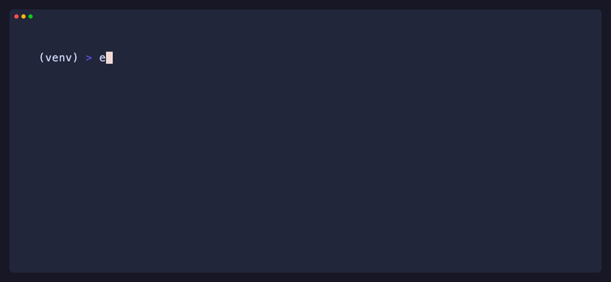

[](https://github.com/equinor/ecalc/actions/workflows/on-push-main-branch.yml)

[](https://github.com/psf/black)


   

# eCalc™
eCalc™ is a software tool for calculation of energy demand and greenhouse gas (GHG) emissions from oil and gas production and processing.

> **Note**
>
> eCalc™ is a work in progress and is by no means considered a finished and final product. We currently recommend to use the YAML API when using eCalc, and only
> fallback to the Python API when it is strictly needed.

> **Warning**
>
> The quality of the results produced by eCalc™ is highly dependent on the quality of the input data. Further, we do not make any guarantees and are not liable for the quality of results when using eCalc™.

---


---
## Reference Links

* [**Documentation**](/docs/docs/about/)
* [**Contribution**](CONTRIBUTING.md)
* [**Security**](SECURITY.md)
* [**Code of Conduct**](CODE_OF_CONDUCT.md)
* [**Source Code**](https://github.com/equinor/ecalc)

---

## Introduction

eCalc™ is a software tool for calculation of energy demand and GHG emissions from oil and gas production and processing. It enables the cross-disciplinary collaboration required to achieve high-quality and transparent energy and GHG emission prognosis and decision support.

eCalc™ performs energy and emission calculations by integrating data, knowledge and future plans from different disciplines. This could be production and injection profiles from the reservoir engineer, characteristics of energy consuming equipment units such as gas turbines, compressors and pumps from the facility engineer, and emission factors for different fuels from the sustainability engineer. The main idea is using physical or data-driven models to relate production rates and pressures to the required processing energy and resulting emissions. Integrated bookkeeping for all emission sources is offered.

eCalc™ uses a bottom-up approach to give high-quality installation and portfolio level forecasts at the same time as detailed insights about the energy drivers and processing capacities for the individual installation.

## Getting started

eCalc™ is both a Python library and has a command line interface (CLI) to use with eCalc YAML Models. We currently recommend using eCalc™ from the command line with eCalc YAML Models, since the Python API is about to change soon, but the YAML will
be more or less stable and backwards compatible.

To get started, please refer to the [eCalc™ Docs - Getting Started](/docs/docs/about/getting_started/),
or follow the quick guide below:

### Prerequisites

* [Python](https://www.python.org/), version 3.11 or higher
* Java, version 8 or higher
* [Docker](https://www.docker.com/) (Optional), Linux or MacOS

eCalc™ only supports Python 3, and will follow [Komodo](https://github.com/equinor/komodo) wrt. minimum requirement for Python, which currently is 3.11.

### Installation

```bash
pip install libecalc
ecalc --version
ecalc selftest
```

**Alternative using Docker**:

```bash
docker build --target build -t ecalc .
docker run -it ecalc /bin/bash
```

Inside the docker container, run:

```bash
ecalc --version
ecalc selftest
```

Please refer to [Docker Docs](https://docs.docker.com/) for details on how to use Docker.

**Alternative using devcontainer**:

In vscode:
- Install extension "Dev Containers" and open command palette (ctrl+p or cmd+p or F1) and click "reopen in container" then click the alternative "eCalc Python Dev Environment".

In github codespaces:
- In the repo click the "<> Code" button -> codespaces -> in the codespaces section click the ellipsis menu (three dots) -> click "New with options.." -> under "Dev container configuration" click and choose "eCalc Python Dev Environment" -> then click button "Create Codespace".




### Create and run your first model

Please refer to the https://equinor.github.io/ecalc/docs/about/modelling/setup/ on how to set up your own model
with the YAML API and https://equinor.github.io/ecalc/docs/about/getting_started/cli/ on how to run it.

See [Examples](#examples) below to use one of our predefined examples.

## Development and Contribution

We welcome all kinds of contributions, including code, bug reports, issues, feature requests, and documentation.
The preferred way of submitting a contribution is to either make an issue on GitHub or by forking the project on GitHub
and making a pull request.

See [Contribution Document](CONTRIBUTING.md) on how to contribute.

See the [Developer Guide](/docs/docs/contribute/get_started.md) for details.

### Running tests

We use pytest for our tests, to run all tests
```shell
poetry run pytest
```

To update inline snapshots
```shell
poetry run pytest -m "inlinesnapshot" --inline-snapshot=fix
```

## Examples
Jupyter Notebook examples can be found in /examples. In order to run these examples, you need to install the optional
dependencies.

### Using pip
```bash
pip install libecalc[notebooks]
``` 

In the examples you will find examples using both the YAML specifications and Python models. See /examples

Run jupyter:

```bash
jupyter notebook examples
```

### Using poetry

```shell
poetry install --extras notebooks
poetry run jupyter notebook examples
```

## Documentation

The documentation can be found at https://equinor.github.io/ecalc
