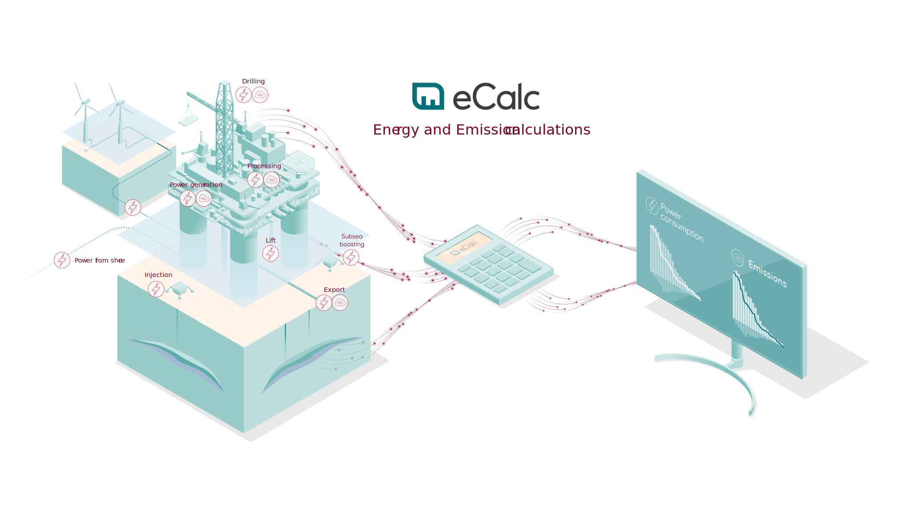

# Introduction to eCalc™

The eCalc™ technology is being developed by Equinor within the Technology, Digital and Innovation (TDI) business area.

## What is eCalc™?
eCalc™ is a software tool for calculation of energy demand and greenhouse gas emissions from oil and gas production and processing. It enables the cross-disciplinary collaboration required to achieve high-quality and transparent energy and GHG emission prognosis and decision support.

eCalc™ performs energy and emission calculations by integrating data, knowledge and future plans from different disciplines. This could be production and injection profiles from the reservoir engineer, characteristics of energy consuming equipment units such as gas turbines, compressors and pumps from the facility engineer, and emission factors for different fuels from the sustainability engineer. The main idea is using physical or data-driven models to relate production rates and pressures to the required processing energy and resulting emissions. Integrated bookkeeping for all emission sources is offered.

eCalc™ uses a bottom-up approach to give high-quality installation and portfolio level forecasts at the same time as detailed insights about the energy drivers and processing capacities for the individual installation.

### Why should I use eCalc™?
By using eCalc™ you will be able to forecast your energy consumption and emissions with consistency and transparency. You will also be enabled to study the effect on energy demand and emissions of your investment opportunities as well as studying emission reduction measures.

### How to use eCalc™?
To use eCalc™ you need to create a model setup of your asset.
This is described in the [Modelling](/about/modelling/index.md) section.

Once the model is ready, you can run the eCalc™ calculator. Different user interfaces for the calculator are offered. These are described in detail in the [Getting started](getting_started/index.md) section.
