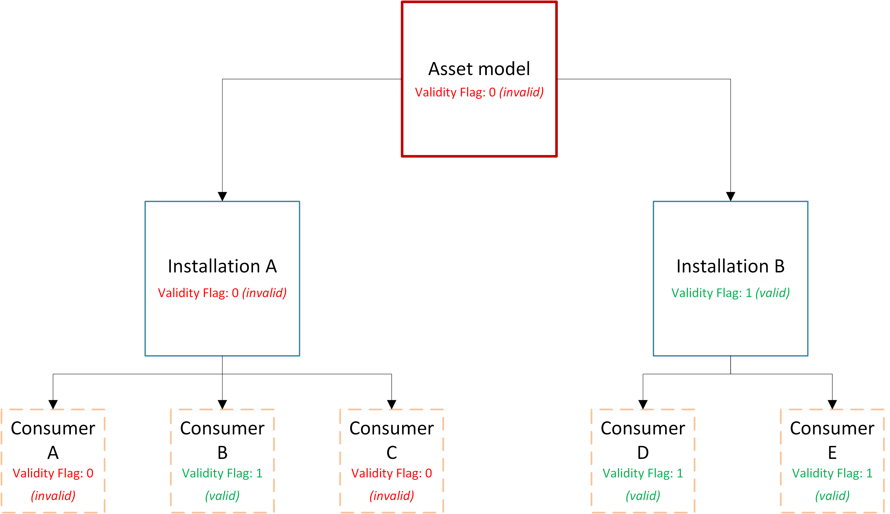

# Input Data

### Timeseries

The file format is a [CSV](https://en.wikipedia.org/wiki/Comma-separated_values) file,
where the first column **MUST** contain the date/timestep and the remaining columns contain numbers. All
columns **MUST** have a header, which is the name of the time series variable. The date column **MUST**
follow the following rules and format specified below:

* The input dates within one file/resource must follow a common and accepted format.
* This ensures a mix of month-first and day-first cannot exist and cause misinterpretation.
* If time is present for one datapoint in file/resource, it must be included in all datapoints.

Accepted formats; only one format is allowed per file/resource:

- *ISO8601* — YYYY.MM.DD
- *ISO8601* (with time) — YYYY.MM.DD HH:MM:SS
- *Day-first* — DD.MM.YYYY
- *Day-first* (with time) — DD.MM.YYYY HH:MM:SS
- *Year only* — YYYY

#### Examples:

##### File1:
```csv
DATE,Variable1,Variable2
2023.01.01,100,200
2023.01.02,110,210
2023.01.03,120,220
```

##### File2:
```csv
Variable1,Variable2,DATE
100,200,01.01.2023
110,210,02.01.2023
120,220,03.01.2023
```

##### NOT ALLOWED (combining date only, with date and time):
```csv
DATE,Variable1,Variable2
01.01.2023,100,200
02.01.2023 10:00:00,110,210
03.01.2023 12:00,120,220
```

### Facility Data

The facility data is also a [CSV](https://en.wikipedia.org/wiki/Comma-separated_values) file. Each column **MUST** have 
a header name. A facility data file has different purposes, depending on where and what it is being used for in the
eCalc YAML file. See [Facility Inputs](/about/references/FACILITY_INPUTS.md) for which types that are supported,
and see the specific type for more details on the expected format.

# Output Data

In general, each model is outputted to a .csv file with what is viewed as necessary information for an operator.
Further details, if necessary, can be seen in a .json file.

## Decimals and significant digits in eCalc

Output numbers/result in eCalc are currently given at "6 significant digits/figures accuracy". This statement is valid
for positive and negative integers and float numbers. Read more about significant digits [here](https://en.wikipedia.org/wiki/Significant_figures).

:::caution
Be aware that the output is never more accurate than the input (ie the measurements/prognosis). So, e.g. if your input
is rounded off to "nearest million", then that is also how you should consider the accuracy of the output. The output accuracy
is not more reliable than the lowest input accuracy given.

:::

In practice, for the output, this means:

* Numbers higher than 1e6 (and lower than -1e6) will not have digits after decimal sign
* Numbers smaller than 1e-6 (and -1e-6) is considered to be 0 (rounded to 0), and we will
not operate with more than 6 digits after the decimal sign.
* We only round numbers in the decimal part, to within the "significant digits"

We may in the future allow user to specify number of significant digits in output, but for now it is fixed.


## Quality control

eCalc™ has a quality control function, which is represented by a validity flag. This validity flag gives the user information to whether or not their model is valid.
This flag can either be seen in the .csv or .json output file.
Essentially, if the `<name>.is_valid` is shown as a `1`, the level is considered to be valid, and on the opposite end if it is shown to be `0`, it can be considered invalid.

The most likely reason for an invalid flag is that a consumer (pump, compressor) is operating outside its operational limit (potentially outside the pump/compressor chart).

This validity flag can be seen on multiple component levels:

- The highest level being the eCalc™ model (or otherwise known as the asset level). If the highest level flag is given as invalid, this means that any number of the installations in the model can have one or more invalid consumer.
- If you dig further down in the component levels, the next would be on installation level. This means that if this flag is given as invalid, any consumer within that installation can be invalid.
- Past the installation level, is the consumer level. Here, the validity of the individual consumers can be seen.
- If the consumer is a multi-stage compressor (for example), the validity of each compression stage can be viewed (only in the .json file when detailed output is selected)

This is further illustrated in the diagram below:


