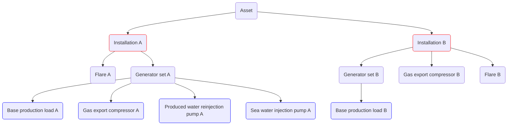

import CodeLinesFromFile from "../../../../src/components/CodeLinesFromFile";
import CodeBlock from '@theme/CodeBlock';
import compressorChartCsv from '!!raw-loader!./advanced_with_invalid_timesteps/compressor_chart.csv';
import compressorSampledCsv from '!!raw-loader!./advanced_with_invalid_timesteps/compressor_sampled.csv';
import genset from '!!raw-loader!./advanced_with_invalid_timesteps/genset.csv';
import pumpChart from '!!raw-loader!./advanced_with_invalid_timesteps/pump_chart.csv';
import baseProfile from '!!raw-loader!./advanced_with_invalid_timesteps/base_profile.csv';
import yamlModel from '!!raw-loader!./advanced_with_invalid_timesteps/model.yaml';

# Advanced model example with invalid timesteps
This is a model very similar to [Simple example](/about/modelling/examples/simple.mdx). The main difference is the use of more advanced
energy usage models and consumer systems, and the addition of a second installation.

Both installations exports oil (`OIL_PROD`) and gas (`GAS_PROD`).
The installations emit CO2 and CH4.

The following is an example with one installation called `Installation A` and `Installation B`.

The results of a performed characterization of the equipment are listed below:

| Consumer                          |Type                | Description                                                                                                                                              |
|-------------------------------------|--------------------|----------------------------------------------------------------------------------------------------------------------------------------------------------|
| Generator set A                   |Generator set       | Variable fuel consumer with electricity to fuel function                                                                                                 |
| Base production load A            |Power consumer      | Production base load varying depending on a binary condition                                                                                             |
| Gas export compressor A         |Power consumer      | Variable consumption depending on gas sales rate                                                                                   |
| Produced water reinjection pump A |Power consumer      | Variable consumption depending on water production rate and water injection rate. The pump suction pressure is 10 bar and discharge pressure is 200 bar. |
| Sea water injection pump A        |Power consumer      | Variable consumption depending on a complex combination on water injection rate and water production rate                                                |
| Flare A                           |Direct fuel consumer| Flare A                                                                                                                                                  |
| Generator set B                   |Generator set      | Variable fuel consumption with electricity to fuel function                                                                                              |
| Base production load B            |Power consumer| Production base load at 7.6 MW                                                                                                                           |
| Gas export compressor B           |Direct fuel consumer| Variable fuel consumption depending on gas sales rate                                                                                                    |
| Flare B                           |Direct fuel consumer| Flare B                                                                                                                                                  |

## YAML model overview
The YAML model consist of these main components:
- Time series inputs - [TIME_SERIES](/about/references/TIME_SERIES.md)
- Facility characterization input - [FACILITY_INPUTS](/about/references/FACILITY_INPUTS.md)
- Fuel input - [FUEL_TYPES](/about/references/FUEL_TYPES.md)
- Model specifications - [MODELS](/about/references/MODELS.md)
- Model variables - [VARIABLES](/about/references/VARIABLES.md)
- Installation topology - [INSTALLATIONS](/about/references/INSTALLATIONS.md)

The YAML setup file looks like this:

~~~~~~~~yaml title="model.yaml"
TIME_SERIES:
  <placeholder>
FACILITY_INPUTS:
  <placeholder>
FUEL_TYPES:
  <placeholder>
VARIABLES:
  <placeholder>
INSTALLATIONS:
  <placeholder>
~~~~~~~~

We will now replace the placeholders for each of the main keywords above.

## TIME_SERIES
The reservoir variables, in this case, are found in a CSV (Comma separated file) `production_data.csv`.
We give the time-series data a name that can be referenced as variables elsewhere in the form `<NAME>:<NAME OF COLUMN>`.
See [TIME_SERIES](/about/references/TIME_SERIES.md) for further details.

<CodeLinesFromFile title="model.yaml" start={1} end={4} language="yaml">{yamlModel}</CodeLinesFromFile>

## FACILITY_INPUTS
We specify CSV input data for processing equipment using FACILITY_INPUTS. This is used for generatorsets,
tabulated/sampled models and pump charts. See [FACILITY_INPUTS](/about/references/FACILITY_INPUTS.md) for further details.

Here we define a tabulated genset, a sampled compressor, and a single speed pump chart.
Note that more complicated energy models are defined under the [MODELS](/about/references/MODELS.md)-keyword. 

<CodeLinesFromFile title="model.yaml" start={6} end={19} language="yaml">{yamlModel}</CodeLinesFromFile>

## FUEL_TYPES
In this example there are two [FUEL_TYPES](/about/references/FUEL_TYPES.md) - `fuel_gas` and `bad_fuel_gas`.
These are used for Installation A and Installation B respectively.
Here we also define emissions in CO2 and CH4:

<CodeLinesFromFile title="model.yaml" start={21} end={35} language="yaml">{yamlModel}</CodeLinesFromFile>

## MODELS

This advanced example requires some energy usage models to be defined under the model section. See [MODELS](/about/references/MODELS.md) for details.

Here we specify:
- Compressor chart based on design points
- Compressor chart based on chart data
- Medium density fluid
- Gas turbine
- Simplified compressor train model

<CodeLinesFromFile title="model.yaml" start={37} end={77} language="yaml">{yamlModel}</CodeLinesFromFile>

See [MODELS](/about/references/MODELS.md) for further details.

## VARIABLES
To run the model it is recommended to specify [VARIABLES](/about/references/VARIABLES.md),
instead of hard coding values in difference places. This makes it easier to develop, maintain and understand the model
by allowing descriptive variable names and avoid duplications.

For our model, we specify the following variables:

<CodeLinesFromFile title="model.yaml" start={79} end={101} language="yaml">{yamlModel}</CodeLinesFromFile>

We reference the [TIME_SERIES](#time_series) `SIM` using the column names from the CSV file.

:::tip
You can use boolean condition such as shown in base_production_load_mw and time varying variables such as shown in
flare_a_fuel_rate_sm3_day and flare_b_fuel_rate_sm3_day to write simpler models with less duplicated code.

The base_production_load_mw adds another 4.1 MW when the gas lift injection rate is positive.

The flare rate changes in year 2030.
:::

## INSTALLATIONS

An installation is composed of hydrocarbon export, a default fuel for that installation and consumers in the form
of generatorsets (with electric sub-consumers), and direct fuel consumers.

We specify:
- `NAME`: the installation name
- `HCEXPORT`: Hydrocarbon export in Sm3/day by referring to the variable $var.hydrocarbon_export_sm3_per_day specified under [VARIABLES](#variables) above.
- `FUEl`: Default fuel specified in [FUEL_TYPES](#fuel_types) above. Note the different fuels used by the two installations.
- `CATEGORY`: FIXED (installation) category is used to group result data for reporting. See [CATEGORY](/about/references/CATEGORY.md) for details.

~~~~~~~~yaml
INSTALLATIONS:
  - NAME: Installation A
    HCEXPORT: $var.hydrocarbon_export_sm3_per_day
    FUEL: fuel_gas
    CATEGORY: FIXED
    GENERATORSETS:
      <placeholder>
    FUELCONSUMERS:
      <placeholder>
  - NAME: Installation B
    HCEXPORT: $var.hydrocarbon_export_sm3_per_day
    FUEL: bad_fuel_gas
    CATEGORY: FIXED
    GENERATORSETS:
      <placeholder>
    FUELCONSUMERS:
      <placeholder>
~~~~~~~~

### Installation A
There is one generator set, `Generator set A`. This has a power to fuel function defined in
[FACILITY_INPUTS](#facility_inputs) with the name `genset`. Further, the consumers getting
power from the generator set are *Base production load*, *Gas injection compressor*, *Produced water reinjection pump*
and *Sea-water injection pump*.

The direct fuel consumers are **Flare**.

The setup for `Installation A` thus becomes:

~~~~~~~~yaml
  - NAME: Installation A
    HCEXPORT: $var.hydrocarbon_export_sm3_per_day
    FUEL: fuel_gas
    CATEGORY: FIXED
    GENERATORSETS:
      - NAME: Generator set A
        CATEGORY: TURBINE-GENERATOR
        ELECTRICITY2FUEL: genset
        CONSUMERS:
          - NAME: Fixed production loads A
            CATEGORY: FIXED-PRODUCTION-LOAD
            ENERGY_USAGE_MODEL: <placeholder>
          - NAME: Gas export compressors system A
            CATEGORY: COMPRESSOR
            ENERGY_USAGE_MODEL: <placeholder>
          - NAME: Water injection pump system A
            CATEGORY: PUMP
            ENERGY_USAGE_MODEL: <placeholder>
          - NAME: Single pump A
            CATEGORY: PUMP
            ENERGY_USAGE_MODEL: <placeholder>
    FUELCONSUMERS:
      - NAME: Flare A
        CATEGORY: FLARE
        ENERGY_USAGE_MODEL: <placeholder>
~~~~~~~~

### Installation B
There is one generator set, `Generator set B`. This has a power to fuel function defined in
[FACILITY_INPUTS](#facility_inputs) with the name `genset`. Further, the consumer getting
power from the generator set is *Base production load*.

The direct fuel consumers are **Flare** and **Gas export compressor**.

The setup for `Installation B` thus becomes:

~~~~~~~~yaml
  - NAME: Installation B
    HCEXPORT: $var.hydrocarbon_export_sm3_per_day
    FUEL: bad_fuel_gas
    CATEGORY: FIXED
    GENERATORSETS:
      - NAME: Generator set B
        CATEGORY: TURBINE-GENERATOR
        ELECTRICITY2FUEL: genset
        CONSUMERS:
          - NAME: Fixed production loads B
            CATEGORY: FIXED-PRODUCTION-LOAD
            ENERGY_USAGE_MODEL: <placeholder>
    FUELCONSUMERS:
      - NAME: Flare B
        CATEGORY: FLARE
        ENERGY_USAGE_MODEL: <placeholder>
      - NAME: Gas export compressors B
        CATEGORY: COMPRESSOR
        ENERGY_USAGE_MODEL: <placeholder>
~~~~~~~~

## ENERGY_USAGE_MODEL
We will now fill in the final placeholders with detailed [ENERGY_USAGE_MODEL](/about/references/ENERGY_USAGE_MODEL.md)s.

`Base production loads A` has a load of 7.6 MW with additional 4.1 MW when the field gas injection rate is positive:

<CodeLinesFromFile title="model.yaml" start={113} end={117} language="yaml">{yamlModel}</CodeLinesFromFile>

`Gas export compressor system A` is represented by a consumer system of two simplified compressor train models.
The system has defined the variable [gas_export_rate_sm3_per_day](#variables) and will run two different
rate distributions between these two compressor trains. It will first send all rate to the first compressor train
and nothing to the second `RATE_FRACTIONS: [1.0, 0.0]` and then it will run the same input while distributing equal
rates to the two compressor trains `RATE_FRACTIONS: [0.5, 0.5]`. The final result will be composed of the first
setting that returns a valid result for the compressors.
See [COMPRESSOR_SYSTEM](/about/modelling/setup/installations/compressor_models_in_calculations/compressor_system.md) for further details.

The model compressor model is defined:
<CodeLinesFromFile start={118} end={134} language="yaml">{yamlModel}</CodeLinesFromFile>

`Water injection pump system A` is variable and its energy function is dependent on the field's water
injection rate (`WATER_INJ`) that is set in the variable [water_injection_rate](#variables) as `SIM;WATER_INJ`.
The pump only runs when the variables [water_injection_condition](#variables) evaluates to true as `SIM;WATER_PROD > 0`.
This is when the water injection rate is positive. Fluid density, suction pressure and discharge pressure
is also defined.

This PUMP_SYSTEM behaves much the same as the COMPRESSOR_SYSTEM above.
See [PUMP_SYSTEM](/about/modelling/setup/installations/pump_models_in_calculations.md#pump_system-energy-usage-model) for further details.
<CodeLinesFromFile start={135} end={164} language="yaml">{yamlModel}</CodeLinesFromFile>

`Single pump A` has an energy function that is dependent on the seawater injection rate, same as the system above.
It uses the pump_chart defined in [FACILITY_INPUTS](#facility_inputs) above.

The pump model is then defined:
<CodeLinesFromFile start={165} end={174} language="yaml">{yamlModel}</CodeLinesFromFile>

The `Flare A` is changing on the 1st of July 2020 and 1st of January 2030. Therefore, we need to use a different constant
fuel consumption value before and after this date. This is done using the variable [flare_a_fuel_rate_sm3_day](#variables).

The model becomes:
<CodeLinesFromFile start={176} end={180} language="yaml">{yamlModel}</CodeLinesFromFile>

`Base production loads B` has a load of 7.6 :
<CodeLinesFromFile start={191} end={195} language="yaml">{yamlModel}</CodeLinesFromFile>

The `Flare B` is changing on the 1st of July 2020 and 1st of January 2030. Therefore, we need to use a different constant
fuel consumption value before and after this date. This is done using the variable [flare_a_fuel_rate_sm3_day](#variables).

The model becomes:
<CodeLinesFromFile start={197} end={201} language="yaml">{yamlModel}</CodeLinesFromFile>

The `Gas export compressors B`  is a variable fuel consumer whose energy function depends on the field gas production rate (`GAS_PROD`) defined
in the variable [gas_export_rate_sm3_per_day](#variables) as `SIM;GAS_PROD`, and put to the condition [gas_export_condition](#variables) as `SIM;GAS_PROD > 0`

The model is specified:
<CodeLinesFromFile start={202} end={210} language="yaml">{yamlModel}</CodeLinesFromFile>

## Full eCalc YAML model
<CodeBlock title="model.yaml" language="yaml">{yamlModel}</CodeBlock>

### Input files
<CodeBlock title="compressor_chart.csv">{compressorChartCsv}</CodeBlock>
<CodeBlock title="compressor_sampled.csv">{compressorSampledCsv}</CodeBlock>
<CodeBlock title="genset.csv">{genset}</CodeBlock>
<CodeBlock title="pump_chart.csv">{pumpChart}</CodeBlock>
<CodeBlock title="base_profile.csv">{baseProfile}</CodeBlock>
