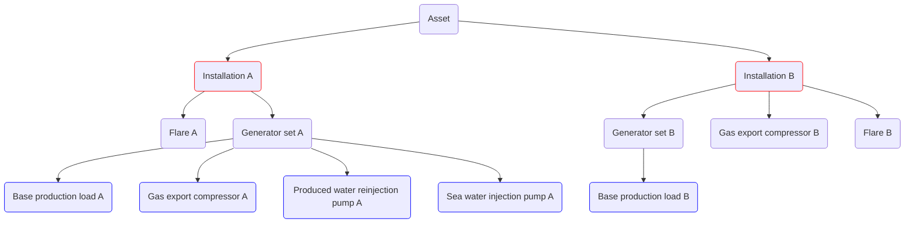

# Advanced model example
This is a model very similar to [Simple example](simple.md). The main difference is the use of more advanced
energy usage models and consumer systems, and the addition of a second installation.

Both installations exports oil (`OIL_PROD`) and gas (`GAS_PROD`).
The installations emits CO2 and CH4 that is subject to taxation and emission quotas.

The following is an example with one installation called `Installation A` and `Installation B`.

The results of a performed characterization of the equipment are listed below:

| Consumer                          |Type                | Description                                                                                                                                              |
|-------------------------------------|--------------------|----------------------------------------------------------------------------------------------------------------------------------------------------------|
| Generator set A                   |Generator set       | Variable fuel consumer with electricity to fuel function                                                                                                 |
| Base production load A            |Power consumer      | Production base load varying depending on a binary condition                                                                                             |
| Gas export compressor A         |Power consumer      | Variable consumption depending on gas sales rate                                                                                   |
| Produced water reinjection pump A |Power consumer      | Variable consumption depending on water production rate and water injection rate. The pump suction pressure is 10 bar and discharge pressure is 200 bar. |
| Sea water injection pump A        |Power consumer      | Variable consumption depending on a complex combination on water injection rate and water production rate                                                |
| Flare A                           |Direct fuel consumer| Flare A                                                                                                                                                  |
| Generator set B                   |Generator set      | Variable fuel consumption with electricity to fuel function                                                                                              |
| Base production load B            |Power consumer| Production base load at 7.6 MW                                                                                                                           |
| Gas export compressor B           |Direct fuel consumer| Variable fuel consumption depending on gas sales rate                                                                                                    |
| Flare B                           |Direct fuel consumer| Flare B                                                                                                                                                  |

## YAML model overview
The YAML model consist of these main components:
- Time series inputs - [TIME_SERIES](../../references/keywords/TIME_SERIES.md)
- Facility characterization input - [FACILITY_INPUTS](../../references/keywords/FACILITY_INPUTS)
- Fuel input - [FUEL_TYPES](../../references/keywords/FUEL_TYPES)
- Model specifications - [MODELS](../../references/keywords/MODELS)
- Model variables - [VARIABLES](../../references/keywords/VARIABLES)
- Installation topology - [INSTALLATIONS](../../references/keywords/INSTALLATIONS)

The YAML setup file looks like this:

~~~~~~~~yaml title="model.yaml"
TIME_SERIES:
  <placeholder>
FACILITY_INPUTS:
  <placeholder>
FUEL_TYPES:
  <placeholder>
VARIABLES:
  <placeholder>
INSTALLATIONS:
  <placeholder>
~~~~~~~~

We will now replace the placeholders for each of the main keywords above.

## TIME_SERIES
The reservoir variables, in this case, are found in a CSV (Comma separated file) `production_data.csv`.
We give the time-series data a name that can be referenced as variables elsewhere in the form `<NAME>:<NAME OF COLUMN>`.
See [TIME_SERIES](../../references/keywords/TIME_SERIES.md) for further details.

~~~~~~~~yaml title="model.yaml"
TIME_SERIES:
  - NAME: SIM
    TYPE: DEFAULT
    FILE: base_profile.csv
~~~~~~~~

## FACILITY_INPUTS
We specify CSV input data for processing equipment using FACILITY_INPUTS. This is used for generatorsets,
tabulated/sampled models and pump charts. See [FACILITY_INPUTS](../../references/keywords/FACILITY_INPUTS.md) for further details.

Here we define a tabulated genset, a sampled compressor, and a single speed pump chart.
Note that more complicated energy models are defined under the [MODELS](../../references/keywords/MODELS.md)-keyword. 

~~~~~~~~yaml title="model.yaml"
FACILITY_INPUTS:
  - NAME: genset
    FILE: genset.csv
    TYPE: ELECTRICITY2FUEL
  - NAME: gasexp
    FILE: compressor_sampled.csv
    TYPE: COMPRESSOR_TABULAR
  - NAME: pump_chart
    FILE: pump_chart.csv
    TYPE: PUMP_CHART_SINGLE_SPEED
    UNITS:
      RATE: AM3_PER_HOUR
      HEAD: M
      EFFICIENCY: PERCENTAGE
~~~~~~~~

## FUEL_TYPES
In this example there are two [FUEL_TYPES](../../references/keywords/FUEL_TYPES) - `fuel_gas` and `bad_fuel_gas`.
These are used for Installation A and Installation B respectively.
Here we also define emissions in CO2 and CH4. Note that the two fuels have different prices,
emissions factors and the same taxes and are defined:

~~~~~~~~yaml title="model.yaml"
FUEL_TYPES:
  - NAME: fuel_gas
    PRICE: 1.5  # NOK/Sm3
    CATEGORY: FUEL-GAS
    EMISSIONS:
      - NAME: CO2
        FACTOR: 2.20 #kg/Sm3
        TAX: 1.51 # NOK/Sm3
      - NAME: CH4
        FACTOR: 0.01 #kg/Sm3
        TAX: 0.9 # NOK/Sm3
  - NAME: bad_fuel_gas
    PRICE: 0.5  # NOK/Sm3
    CATEGORY: FUEL-GAS
    EMISSIONS:
      - NAME: CO2
        FACTOR: 5.0 #kg/Sm3
        TAX: 1.51 # NOK/Sm3
      - NAME: CH4
        FACTOR: 0.01 #kg/Sm3
        TAX: 0.9 # NOK/Sm3
~~~~~~~~

## MODELS

This advanced example requires some energy usage models to be defined under the model section. See [MODELS](../../references/keywords/MODELS) for details.

Here we specify:
- Compressor chart based on design points
- Compressor chart based on chart data
- Medium density fluid
- Gas turbine
- Simplified compressor train model

~~~~~~~~yaml title="model.yaml"
MODELS:
  - NAME: generic_from_design_point_compressor_chart
    TYPE: COMPRESSOR_CHART
    CHART_TYPE: GENERIC_FROM_DESIGN_POINT
    POLYTROPIC_EFFICIENCY: 0.75
    DESIGN_RATE: 10000
    DESIGN_HEAD: 80
    UNITS:
      RATE: AM3_PER_HOUR
      HEAD: KJ_PER_KG
      EFFICIENCY: FRACTION
  - NAME: predefined_variable_speed_compressor_chart
    TYPE: COMPRESSOR_CHART
    CHART_TYPE: VARIABLE_SPEED
    UNITS:
      RATE: AM3_PER_HOUR
      HEAD: M # M or KJ_PER_KG
      EFFICIENCY: FRACTION
    CURVES:
      FILE: compressor_chart.csv
  - NAME: medium_fluid
    TYPE: FLUID
    FLUID_MODEL_TYPE: PREDEFINED
    EOS_MODEL: SRK
    GAS_TYPE: MEDIUM
  - NAME: turbine
    TYPE: TURBINE
    LOWER_HEATING_VALUE: 38 # [MJ/Sm3]
    TURBINE_LOADS: [0, 2.352, 4.589, 6.853, 9.125, 11.399, 13.673, 15.947, 18.223, 20.496, 22.767] # MW
    TURBINE_EFFICIENCIES: [0, 0.138, 0.210, 0.255, 0.286, 0.310, 0.328, 0.342, 0.353, 0.360, 0.362]
  - NAME: simplified_compressor_train_model
    TYPE: SIMPLIFIED_VARIABLE_SPEED_COMPRESSOR_TRAIN
    FLUID_MODEL: medium_fluid
    COMPRESSOR_TRAIN:
      STAGES:
        - INLET_TEMPERATURE: 30
          COMPRESSOR_CHART: generic_from_design_point_compressor_chart
        - INLET_TEMPERATURE: 30
          COMPRESSOR_CHART: generic_from_design_point_compressor_chart
        - INLET_TEMPERATURE: 30
          COMPRESSOR_CHART: predefined_variable_speed_compressor_chart
~~~~~~~~

See [MODELS](../../references/keywords/MODELS) for further details.

## VARIABLES
To run the model it is recommended to specify [VARIABLES](../../references/keywords/VARIABLES),
instead of hard coding values in difference places. This makes it easier to develop, maintain and understand the model
by allowing descriptive variable names and avoid duplications.

For our model, we specify the following variables:

~~~~~~~~yaml title="model.yaml"
VARIABLES:
  hydrocarbon_export_sm3_per_day:
    VALUE: SIM;OIL_PROD {+} SIM;GAS_PROD {/} 1000
  gas_export_rate_sm3_per_day:
    VALUE: SIM;GAS_PROD
  water_injection_rate:
    VALUE: SIM;WATER_INJ
  gas_export_condition:
    VALUE: SIM;GAS_PROD > 0
  base_production_load_mw:
    VALUE: 7.6 {+} 4.1 {*} (SIM;GAS_LIFT > 0)
  water_injection_condition:
    VALUE: SIM;WATER_PROD >0
  flare_a_fuel_rate_sm3_day:
    2020-06-01:
      VALUE: 5000
    2030-01-01:
      VALUE: 2000
  flare_b_fuel_rate_sm3_day:
    2020-06-01:
      VALUE: 10000
    2030-01-01:
      VALUE: 7000
~~~~~~~~

We reference the [TIME_SERIES](#time_series) `SIM` using the column names from the CSV file.

:::tip
You can use boolean condition such as shown in base_production_load_mw and time varying variables such as shown in
flare_a_fuel_rate_sm3_day and flare_b_fuel_rate_sm3_day to write simpler models with less duplicated code.

The base_production_load_mw adds another 4.1 MW when the gas lift injection rate is positive.

The flare rate changes in year 2030.
:::

## INSTALLATIONS

An installation is composed of hydrocarbon export, a default fuel for that installation and consumers in the form
of generatorsets (with electric sub-consumers), and direct fuel consumers.

We specify:
- `NAME`: the installation name
- `HCEXPORT`: Hydrocarbon export in Sm3/day by referring to the variable $var.hydrocarbon_export_sm3_per_day specified under [VARIABLES](#variables) above.
- `FUEl`: Default fuel specified in [FUEL_TYPES](#fuel_types) above. Note the different fuels used by the two installations.
- `CATEGORY`: FIXED (installation) category is used to group result data for reporting. See [CATEGORY](../../references/keywords/CATEGORY) for details.

~~~~~~~~yaml
INSTALLATIONS:
  - NAME: Installation A
    HCEXPORT: $var.hydrocarbon_export_sm3_per_day
    FUEL: fuel_gas
    CATEGORY: FIXED
    GENERATORSETS:
      <placeholder>
    FUELCONSUMERS:
      <placeholder>
  - NAME: Installation B
    HCEXPORT: $var.hydrocarbon_export_sm3_per_day
    FUEL: bad_fuel_gas
    CATEGORY: FIXED
    GENERATORSETS:
      <placeholder>
    FUELCONSUMERS:
      <placeholder>
~~~~~~~~

### Installation A
There is one generator set, `Generator set A`. This has a power to fuel function defined in
[FACILITY_INPUTS](#facility_inputs) with the name `genset`. Further, the consumers getting
power from the generator set are *Base production load*, *Gas injection compressor*, *Produced water reinjection pump*
and *Sea-water injection pump*.

The direct fuel consumers are **Flare**.

The setup for `Installation A` thus becomes:

~~~~~~~~yaml
  - NAME: Installation A
    HCEXPORT: $var.hydrocarbon_export_sm3_per_day
    FUEL: fuel_gas
    CATEGORY: FIXED
    GENERATORSETS:
      - NAME: Generator set A
        CATEGORY: TURBINE-GENERATOR
        ELECTRICITY2FUEL: genset
        CONSUMERS:
          - NAME: Fixed production loads A
            CATEGORY: FIXED-PRODUCTION-LOAD
            ENERGY_USAGE_MODEL: <placeholder>
          - NAME: Gas export compressors system A
            CATEGORY: COMPRESSOR
            ENERGY_USAGE_MODEL: <placeholder>
          - NAME: Water injection pump system A
            CATEGORY: PUMP
            ENERGY_USAGE_MODEL: <placeholder>
          - NAME: Single pump A
            CATEGORY: PUMP
            ENERGY_USAGE_MODEL: <placeholder>
    FUELCONSUMERS:
      - NAME: Flare A
        CATEGORY: FLARE
        ENERGY_USAGE_MODEL: <placeholder>
~~~~~~~~

### Installation B
There is one generator set, `Generator set B`. This has a power to fuel function defined in
[FACILITY_INPUTS](#facility_inputs) with the name `genset`. Further, the consumer getting
power from the generator set is *Base production load*.

The direct fuel consumers are **Flare** and **Gas export compressor**.

The setup for `Installation B` thus becomes:

~~~~~~~~yaml
  - NAME: Installation B
    HCEXPORT: $var.hydrocarbon_export_sm3_per_day
    FUEL: bad_fuel_gas
    CATEGORY: FIXED
    GENERATORSETS:
      - NAME: Generator set B
        CATEGORY: TURBINE-GENERATOR
        ELECTRICITY2FUEL: genset
        CONSUMERS:
          - NAME: Fixed production loads B
            CATEGORY: FIXED-PRODUCTION-LOAD
            ENERGY_USAGE_MODEL: <placeholder>
    FUELCONSUMERS:
      - NAME: Flare B
        CATEGORY: FLARE
        ENERGY_USAGE_MODEL: <placeholder>
      - NAME: Gas export compressors B
        CATEGORY: COMPRESSOR
        ENERGY_USAGE_MODEL: <placeholder>
~~~~~~~~

## ENERGY_USAGE_MODEL
We will now fill in the final placeholders with detailed [ENERGY_USAGE_MODEL](../../references/keywords/ENERGY_USAGE_MODEL.md)s.

`Base production loads A` has a load of 7.6 MW with additional 4.1 MW when the field gas injection rate is positive:

~~~~~~~~yaml
          - NAME: Fixed production loads A
            CATEGORY: FIXED-PRODUCTION-LOAD
            ENERGY_USAGE_MODEL:
              TYPE: DIRECT
              LOAD: $var.base_production_load_mw
~~~~~~~~

`Gas export compressor system A` is represented by a consumer system of two simplified compressor train models.
The system has defined the variable [gas_export_rate_sm3_per_day](#variables) and will run two different
rate distributions between these two compressor trains. It will first send all rate to the first compressor train
and nothing to the second `RATE_FRACTIONS: [1.0, 0.0]` and then it will run the same input while distributing equal
rates to the two compressor trains `RATE_FRACTIONS: [0.5, 0.5]`. The final result will be composed of the first
setting that returns a valid result for the compressors.
See [COMPRESSOR_SYSTEM](../../references/keywords/ENERGY_USAGE_MODEL#compressor-system) for further details.

The model compressor model is defined:
~~~~~~~~yaml
          - NAME: Gas export compressors system A
            CATEGORY: COMPRESSOR
            ENERGY_USAGE_MODEL:
              TYPE: COMPRESSOR_SYSTEM
              COMPRESSORS:
                - NAME: train1_A
                  COMPRESSOR_MODEL: simplified_compressor_train_model
                - NAME: train2_A
                  COMPRESSOR_MODEL: simplified_compressor_train_model
              TOTAL_SYSTEM_RATE: $var.gas_export_rate_sm3_per_day
              OPERATIONAL_SETTINGS:
              - RATE_FRACTIONS: [1.0, 0.0]
                SUCTION_PRESSURE: 20
                DISCHARGE_PRESSURE: 120
              - RATE_FRACTIONS: [0.5, 0.5]
                SUCTION_PRESSURE: 20
                DISCHARGE_PRESSURE: 120
~~~~~~~~

`Water injection pump system A` is variable and its energy function is dependent on the field's water
injection rate (`WATER_INJ`) that is set in the variable [water_injection_rate](#variables) as `SIM;WATER_INJ`.
The pump only runs when the variables [water_injection_condition](#variables) evaluates to true as `SIM;WATER_PROD > 0`.
This is when the water injection rate is positive. Fluid density, suction pressure and discharge pressure
is also defined.

This PUMP_SYSTEM behaves much the same as the COMPRESSOR_SYSTEM above.
See [PUMP_SYSTEM](../../references/keywords/ENERGY_USAGE_MODEL#pump-system) for further details.

~~~~~~~~yaml
          - NAME: Water injection pump system A
            CATEGORY: PUMP
            ENERGY_USAGE_MODEL:
              TYPE: PUMP_SYSTEM
              PUMPS:
                - NAME: pump1
                  CHART: pump_chart
                - NAME: pump2
                  CHART: pump_chart
                - NAME: pump3
                  CHART: pump_chart
                - NAME: pump4
                  CHART: pump_chart
              FLUID_DENSITY: 1026
              TOTAL_SYSTEM_RATE: $var.water_injection_rate
              CONDITION: $var.water_injection_condition
              OPERATIONAL_SETTINGS:
                - RATE_FRACTIONS: [1, 0, 0, 0]
                  SUCTION_PRESSURES: [3, 3, 3, 3]
                  DISCHARGE_PRESSURES: [200, 200, 200, 200]
                  CROSSOVER: [2, 0, 0, 0]
                - RATE_FRACTIONS: [0.5, 0.5, 0, 0]
                  SUCTION_PRESSURE: 3
                  DISCHARGE_PRESSURE: 200
                - RATE_FRACTIONS: [0.33, 0.33, 0.34, 0]
                  SUCTION_PRESSURE: 3
                  DISCHARGE_PRESSURE: 200
                - RATE_FRACTIONS:  [0.25, 0.25, 0.25, 0.25]
                  SUCTION_PRESSURE: 3
                  DISCHARGE_PRESSURE: 200
~~~~~~~~

`Single pump A` has an energy function that is dependent on the seawater injection rate, same as the system above.
It uses the pump_chart defined in [FACILITY_INPUTS](#facility_inputs) above.

The pump model is then defined:
~~~~~~~~yaml
          - NAME: Single pump A
            CATEGORY: PUMP
            ENERGY_USAGE_MODEL:
              TYPE: PUMP
              CONDITION: $var.water_injection_condition
              ENERGYFUNCTION: pump_chart
              RATE: 5000
              SUCTION_PRESSURE: 3
              DISCHARGE_PRESSURE: 200
              FLUID_DENSITY: 1026
~~~~~~~~

The `Flare A` is changing on the 1st of July 2020 and 1st of January 2030. Therefore, we need to use a different constant
fuel consumption value before and after this date. This is done using the variable [flare_a_fuel_rate_sm3_day](#variables).

The model becomes:
~~~~~~~~yaml
      - NAME: Flare A
        CATEGORY: FLARE
        ENERGY_USAGE_MODEL:
          TYPE: DIRECT
          FUELRATE: $var.flare_a_fuel_rate_sm3_day
~~~~~~~~

`Base production loads B` has a load of 7.6 :

~~~~~~~~yaml
          - NAME: Fixed production loads B
            CATEGORY: FIXED-PRODUCTION-LOAD
            ENERGY_USAGE_MODEL:
              TYPE: DIRECT
              LOAD: 7.6
~~~~~~~~

The `Flare B` is changing on the 1st of July 2020 and 1st of January 2030. Therefore, we need to use a different constant
fuel consumption value before and after this date. This is done using the variable [flare_a_fuel_rate_sm3_day](#variables).

The model becomes:
~~~~~~~~yaml
      - NAME: Flare B
        CATEGORY: FLARE
        ENERGY_USAGE_MODEL:
          TYPE: DIRECT
          FUELRATE: $var.flare_b_fuel_rate_sm3_day
~~~~~~~~

The `Gas export compressors B`  is a variable fuel consumer whose energy function depends on the field gas production rate (`GAS_PROD`) defined
in the variable [gas_export_rate_sm3_per_day](#variables) as `SIM;GAS_PROD`, and put to the condition [gas_export_condition](#variables) as `SIM;GAS_PROD > 0`

The model is specified:
~~~~~~~~yaml
      - NAME: Gas export compressors B
        CATEGORY: COMPRESSOR
        ENERGY_USAGE_MODEL:
          TYPE: COMPRESSOR
          ENERGYFUNCTION: gasexp
          CONDITION: $var.gas_export_condition
          RATE: $var.gas_export_rate_sm3_per_day
          SUCTION_PRESSURE: 20
          DISCHARGE_PRESSURE: 200
~~~~~~~~

## Full eCalc YAML model
~~~~~~~~yaml title="model.yaml"
TIME_SERIES:
  - NAME: SIM
    TYPE: DEFAULT
    FILE: base_profile.csv

FACILITY_INPUTS:
  - NAME: genset
    FILE: genset.csv
    TYPE: ELECTRICITY2FUEL
  - NAME: gasexp
    FILE: compressor_sampled.csv
    TYPE: COMPRESSOR_TABULAR
  - NAME: pump_chart
    FILE: pump_chart.csv
    TYPE: PUMP_CHART_SINGLE_SPEED
    UNITS:
      RATE: AM3_PER_HOUR
      HEAD: M
      EFFICIENCY: PERCENTAGE

FUEL_TYPES:
  - NAME: fuel_gas
    PRICE: 1.5  # NOK/Sm3
    CATEGORY: FUEL-GAS
    EMISSIONS:
      - NAME: CO2
        FACTOR: 2.20 #kg/Sm3
        TAX: 1.51 # NOK/Sm3
      - NAME: CH4
        FACTOR: 0.01 #kg/Sm3
        TAX: 0.9 # NOK/Sm3
  - NAME: bad_fuel_gas
    PRICE: 0.5  # NOK/Sm3
    CATEGORY: FUEL-GAS
    EMISSIONS:
      - NAME: CO2
        FACTOR: 5.0 #kg/Sm3
        TAX: 1.51 # NOK/Sm3
      - NAME: CH4
        FACTOR: 0.01 #kg/Sm3
        TAX: 0.9 # NOK/Sm3

MODELS:
  - NAME: generic_from_design_point_compressor_chart
    TYPE: COMPRESSOR_CHART
    CHART_TYPE: GENERIC_FROM_DESIGN_POINT
    POLYTROPIC_EFFICIENCY: 0.75
    DESIGN_RATE: 10000
    DESIGN_HEAD: 80
    UNITS:
      RATE: AM3_PER_HOUR
      HEAD: KJ_PER_KG
      EFFICIENCY: FRACTION
  - NAME: predefined_variable_speed_compressor_chart
    TYPE: COMPRESSOR_CHART
    CHART_TYPE: VARIABLE_SPEED
    UNITS:
      RATE: AM3_PER_HOUR
      HEAD: M # M or KJ_PER_KG
      EFFICIENCY: FRACTION
    CURVES:
      FILE: compressor_chart.csv
  - NAME: medium_fluid
    TYPE: FLUID
    FLUID_MODEL_TYPE: PREDEFINED
    EOS_MODEL: SRK
    GAS_TYPE: MEDIUM
  - NAME: turbine
    TYPE: TURBINE
    LOWER_HEATING_VALUE: 38 # MJ/Sm3
    TURBINE_LOADS: [0, 2.352, 4.589, 6.853, 9.125, 11.399, 13.673, 15.947, 18.223, 20.496, 22.767] # MW
    TURBINE_EFFICIENCIES: [0, 0.138, 0.210, 0.255, 0.286, 0.310, 0.328, 0.342, 0.353, 0.360, 0.362]
  - NAME: simplified_compressor_train_model
    TYPE: SIMPLIFIED_VARIABLE_SPEED_COMPRESSOR_TRAIN
    FLUID_MODEL: medium_fluid
    COMPRESSOR_TRAIN:
      STAGES:
        - INLET_TEMPERATURE: 30
          COMPRESSOR_CHART: generic_from_design_point_compressor_chart
        - INLET_TEMPERATURE: 30
          COMPRESSOR_CHART: generic_from_design_point_compressor_chart
        - INLET_TEMPERATURE: 30
          COMPRESSOR_CHART: predefined_variable_speed_compressor_chart

VARIABLES:
  hydrocarbon_export_sm3_per_day:
    VALUE: SIM;OIL_PROD {+} SIM;GAS_PROD {/} 1000
  gas_export_rate_sm3_per_day:
    VALUE: SIM;GAS_PROD
  water_injection_rate:
    VALUE: SIM;WATER_INJ
  gas_export_condition:
    VALUE: SIM;GAS_PROD > 0
  base_production_load_mw:
    VALUE: 7.6 {+} 4.1 {*} (SIM;GAS_LIFT > 0)
  water_injection_condition:
    VALUE: SIM;WATER_PROD >0
  flare_a_fuel_rate_sm3_day:
    2020-06-01:
      VALUE: 5000
    2030-01-01:
      VALUE: 2000
  flare_b_fuel_rate_sm3_day:
    2020-06-01:
      VALUE: 10000
    2030-01-01:
      VALUE: 7000

INSTALLATIONS:
  - NAME: Installation A
    HCEXPORT: $var.hydrocarbon_export_sm3_per_day
    FUEL: fuel_gas
    CATEGORY: FIXED
    GENERATORSETS:
      - NAME: Generator set A
        CATEGORY: TURBINE-GENERATOR
        ELECTRICITY2FUEL: genset
        CONSUMERS:
          - NAME: Fixed production loads A
            CATEGORY: FIXED-PRODUCTION-LOAD
            ENERGY_USAGE_MODEL:
              TYPE: DIRECT
              LOAD: $var.base_production_load_mw
          - NAME: Gas export compressors system A
            CATEGORY: COMPRESSOR
            ENERGY_USAGE_MODEL:
              TYPE: COMPRESSOR_SYSTEM
              COMPRESSORS:
                - NAME: train1_A
                  COMPRESSOR_MODEL: simplified_compressor_train_model
                - NAME: train2_A
                  COMPRESSOR_MODEL: simplified_compressor_train_model
              TOTAL_SYSTEM_RATE: $var.gas_export_rate_sm3_per_day
              OPERATIONAL_SETTINGS:
              - RATE_FRACTIONS: [1.0, 0.0]
                SUCTION_PRESSURE: 20
                DISCHARGE_PRESSURE: 120
              - RATE_FRACTIONS: [0.5, 0.5]
                SUCTION_PRESSURE: 20
                DISCHARGE_PRESSURE: 120
          - NAME: Water injection pump system A
            CATEGORY: PUMP
            ENERGY_USAGE_MODEL:
              TYPE: PUMP_SYSTEM
              PUMPS:
                - NAME: pump1
                  CHART: pump_chart
                - NAME: pump2
                  CHART: pump_chart
                - NAME: pump3
                  CHART: pump_chart
                - NAME: pump4
                  CHART: pump_chart
              FLUID_DENSITY: 1026
              TOTAL_SYSTEM_RATE: $var.water_injection_rate
              CONDITION: $var.water_injection_condition
              OPERATIONAL_SETTINGS:
                - RATE_FRACTIONS: [1, 0, 0, 0]
                  SUCTION_PRESSURES: [3, 3, 3, 3]
                  DISCHARGE_PRESSURES: [200, 200, 200, 200]
                  CROSSOVER: [2, 0, 0, 0]
                - RATE_FRACTIONS: [0.5, 0.5, 0, 0]
                  SUCTION_PRESSURE: 3
                  DISCHARGE_PRESSURE: 200
                - RATE_FRACTIONS: [0.33, 0.33, 0.34, 0]
                  SUCTION_PRESSURE: 3
                  DISCHARGE_PRESSURE: 200
                - RATE_FRACTIONS:  [0.25, 0.25, 0.25, 0.25]
                  SUCTION_PRESSURE: 3
                  DISCHARGE_PRESSURE: 200
          - NAME: Single pump A
            CATEGORY: PUMP
            ENERGY_USAGE_MODEL:
              TYPE: PUMP
              CONDITION: $var.water_injection_condition
              ENERGYFUNCTION: pump_chart
              RATE: 5000
              SUCTION_PRESSURE: 3
              DISCHARGE_PRESSURE: 200
              FLUID_DENSITY: 1026
    FUELCONSUMERS:
      - NAME: Flare A
        CATEGORY: FLARE
        ENERGY_USAGE_MODEL:
          TYPE: DIRECT
          FUELRATE: $var.flare_a_fuel_rate_sm3_day

  - NAME: Installation B
    HCEXPORT: $var.hydrocarbon_export_sm3_per_day
    FUEL: bad_fuel_gas
    CATEGORY: FIXED
    GENERATORSETS:
      - NAME: Generator set B
        CATEGORY: TURBINE-GENERATOR
        ELECTRICITY2FUEL: genset
        CONSUMERS:
          - NAME: Fixed production loads B
            CATEGORY: FIXED-PRODUCTION-LOAD
            ENERGY_USAGE_MODEL:
              TYPE: DIRECT
              LOAD: 7.6
    FUELCONSUMERS:
      - NAME: Flare B
        CATEGORY: FLARE
        ENERGY_USAGE_MODEL:
          TYPE: DIRECT
          FUELRATE: $var.flare_b_fuel_rate_sm3_day
      - NAME: Gas export compressors B
        CATEGORY: COMPRESSOR
        ENERGY_USAGE_MODEL:
          TYPE: COMPRESSOR
          ENERGYFUNCTION: gasexp
          CONDITION: $var.gas_export_condition
          RATE: $var.gas_export_rate_sm3_per_day
          SUCTION_PRESSURE: 20
          DISCHARGE_PRESSURE: 200
~~~~~~~~

### Input files
~~~~~~~~text title="compressor_chart.csv"
RATE,       HEAD,   EFFICIENCY, SPEED
# [m3/h],   [m],    [frac],     [rpm]
3000,       8500,   0.72,       7500
3500,       8000,   0.75,       7500
4000,       7500,   0.74,       7500
4500,       6500,   0.70,       7500
4100,       16500,  0.72,       10500
4600,       16000,  0.73,       10500
5000,       15500,  0.74,       10500
5500,       14500,  0.74,       10500
6000,       13500,  0.72,       10500
6500,       12000,  0.70,       10500
~~~~~~~~

~~~~~~~~text title="compressor_sampled.csv"
RATE,   FUEL
0,      0
0.01,   100
10,     500
20,     1200
~~~~~~~~

~~~~~~~~text title="genset.csv"
POWER,  FUEL
# [MW], [Sm3/d]
0,       0
0.1,     75000
10,      80000
20,      100000
50,      500000
100,     1000000

~~~~~~~~

~~~~~~~~text title="pump_chart.csv"
RATE,       HEAD,   EFFICIENCY, SPEED
# [m3/h],   [m],    [%],        [rpm]   
250,        2350,   50,         10000
300,        2300,   55,         10000
350,        2250,   60,         10000
400,        2200,   70,         10000
450,        2150,   75,         10000
500,        2100,   80,         10000
550,        2050,   75,         10000
600,        2000,   70,         10000
~~~~~~~~

~~~~~~~~text title="base_profile.csv"
DATE,           OIL_PROD,  WATER_PROD,  GAS_PROD,  WATER_INJ,  GAS_LIFT
01.01.2020,     1000,      20000,       4000000,   30000,      1200000
01.01.2021,     1000,      20000,       4000000,   30000,      1200000
01.01.2022,     1000,      20000,       4000000,   30000,      1200000
01.01.2023,     2500,      21000,       4000000,   30000,      1200000
01.01.2024,     3000,      22000,       4500000,   28000,      1300000
01.01.2025,     3500,      23000,       5000000,   26000,      1350000
01.01.2026,     4000,      24000,       5500000,   25000,      1400000
01.01.2027,     4000,      25000,       6000000,   24000,      1400000
01.01.2028,     4000,      20000,       6000000,   23000,      1400000
01.01.2029,     5000,      20000,       5500000,   22000,      1350000
01.01.2030,     9000,      20000,       5000000,   21000,      1300000
01.01.2031,     5000,      20000,       3000000,   22000,      1300000
01.01.2032,     4000,      22100,       3000000,   23000,      2000000
01.01.2033,     4000,      22100,       3000000,   23000,      2000000
01.01.2034,     1200,      25000,       1000000,   21000,      2000000
01.01.2035,     1100,      25000,       1000000,   20000,      1500000
01.01.2036,     1000,      22000,       500000,    18000,      1400000
01.01.2037,     900,       20000,       500000,    17000,      1400000
01.01.2038,     800,       18000,       500000,    17000,      1400000
01.01.2039,     700,       18000,       200000,    17000,      1400000
01.01.2040,     600,       10000,       200000,    15000,      1400000
01.01.2041,     0,         0,           0,          0,         0
~~~~~~~~
