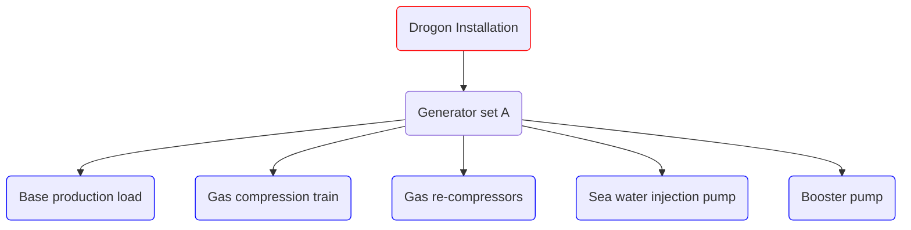

# Drogon model example

The Drogon example is based on a synthetic data set.

On the installation, the following consumers are identified:

The results of a performed characterization of the equipment are listed below:

| Consumer                         |Type                | Description                                                                                                                                              |
|----------------------------------|--------------------|----------------------------------------------------------------------------------------------------------------------------------------------------------|
| Generator set A                |Generator set       | Variable fuel consumer with electricity to fuel function                                                                                                 |
| Base production load             |Power consumer      | Constant load - 10 MW                                                                                                                                    |
| Gas compression train         |Power consumer      |  Variable consumption depending on produced gas rate                                                                      |
| Gas re-compressors         |Power consumer      |  Constant load - 2 MW                                                                      |
| Sea water injection pump         |Power consumer      | Variable consumption depending on water injection rate                                               |
| Booster pump       |Power consumer      | Constant load - 2 MW |

## YAML model overview

The YAML model consists of the following components:

* Time series input
* Facility inputs
* Model inputs
* Fuel type input
* Installation topography

The skeleton of the YAML file looks like the following:

~~~~~~~~yaml
TIME_SERIES: 
    <placeholder>
FACILITY_INPUTS:
    <placeholder>
MODELS:
    <placeholder>
FUEL_TYPES:
    <placeholder>
INSTALLATIONS:
    <placeholder>
~~~~~~~~

## TIME_SERIES

The reservoir variables. In this case the file is called: `drogon_mean.csv`. 

~~~~~~~~yaml
TIME_SERIES: 
    - NAME: SIM1
      TYPE: DEFAULT
      FILE: drogon_mean.csv
~~~~~~~~

## FACILITY_INPUTS

In this case, the compressors are not specified in this section as [GENERIC COMPRESSOR CHARTS](/about/modelling/setup/models/compressor_modelling/compressor_charts/index.md). Thus, the pump chart and generator set will be the only facility components specified within this section. 

The pump will be variable speed, meaning that the pump type will be `PUMP_CHART_VARIABLE_SPEED`. The generator set will be a tabulated, where power consumption will be linked to fuel gas utilised.

~~~~~~~~yaml
FACILITY_INPUTS: 
    - NAME: genset_a_power_fuel
      TYPE: ELECTRICITY2FUEL
      FILE: genset.csv
    - NAME: wi_200
      FILE: wi_200bar_vsp.csv
      TYPE: PUMP_CHART_VARIABLE_SPEED
      UNITS:
        HEAD: M
        RATE: AM3_PER_HOUR
        EFFICIENCY: PERCENTAGE
~~~~~~~~

## MODELS

The model section will contain the fluid model, the compressor chart and the subsequent compressor model. 
Peng-Robinson (PR) will be the selected equation of state in this example. 

This example will use a generic compressor chart. In this case, a generic compressor chart from input will utilised. Here, the a "typical" chart will be shifted to match the input head and rate data. See [GENERIC COMPRESSOR CHARTS](../setup/models/compressor_modelling/compressor_charts/index.md) for more details. When a generic chart is used, a polytropic efficiency needs to be specified. This value will be constant throughout the use, in this case a value of 0.8 is used.

A [SIMPLIFIED_VARIABLE_SPEED_COMPRESSOR_TRAIN](/about/modelling/setup/models/compressor_modelling/compressor_models_types/simplified_variable_speed_compressor_train_model.md) model is used in this example, as this is necessary when a generic chart is used. Instead of manually specifying the number of compression stages, a `MAXIMUM_PRESSURE_RATIO_PER_STAGE` of 3.5 is defined. This will automatically distribute the pressure increase amongst the compression train so that no pressure ratio per compression stage will be above 3.5. 

~~~~~~~~yaml
MODELS:
  - NAME: drogon_fluid
    TYPE: FLUID
    FLUID_MODEL_TYPE: COMPOSITION
    EOS_MODEL: PR
    COMPOSITION:
      water: 0.0
      nitrogen: 0.510676386339746
      CO2: 2.44965511776504
      methane: 75.6328106126248
      ethane: 10.9074631209139
      propane: 8.11875087121037
      i_butane: 0.849146377471569
      n_butane: 1.34903656604691
      i_pentane: 0.104982143381498
      n_pentane: 0.071218218251483
      n_hexane: 0.0063

  - NAME: generic_from_input_compressor_chart
    TYPE: COMPRESSOR_CHART
    CHART_TYPE: GENERIC_FROM_INPUT
    POLYTROPIC_EFFICIENCY: 0.8
    UNITS:
      EFFICIENCY: FRACTION

  - NAME: simplified_compressor_train_model
    TYPE: SIMPLIFIED_VARIABLE_SPEED_COMPRESSOR_TRAIN
    FLUID_MODEL: drogon_fluid
    COMPRESSOR_TRAIN:
      MAXIMUM_PRESSURE_RATIO_PER_STAGE: 3.5
      COMPRESSOR_CHART: generic_from_input_compressor_chart
      INLET_TEMPERATURE: 19.3
~~~~~~~~

## FUEL_TYPES

The fuel gas has a CO2 factor of 2.416.

~~~~~~~~yaml
FUEL_TYPES:
  - NAME: fuel_gas
    CATEGORY: FUEL-GAS
    EMISSIONS:
      - NAME: CO2
        FACTOR: 2.416  #CO2/Sm3 fuel gas burned
~~~~~~~~

## INSTALLATIONS

In the `INSTALLATIONS` section, the previously defined models and facility inputs are further defined. Here the hydrocarbon export can be specified. This is used in order to get a hydrocarbon-to-emission value. In this case, it is assumed that this facility exports oil (`OIL_PROD`) and gas (`GAS_PROD`).

~~~~~~~~yaml
INSTALLATIONS:
  - NAME: drogon
    CATEGORY: FIXED
    HCEXPORT: SIM1;OIL_PROD {+} SIM1;GAS_PROD {/} 1000
    FUEL: fuel_gas
~~~~~~~~

### GENERATORSETS

There is one generator set used in this example - `Generator set A`. This is a tabular relationship between power generated/consumed and fuel gas burnt.
Under this category, all consumers that utilise electricity are defined. In this case scenario, all pumps and compressors are electrically driven; thus, all consumers will be specified under this category.

~~~~~~~~yaml
    GENERATORSETS:
      - NAME: main_power
        ELECTRICITY2FUEL: genset_a_power_fuel
        CATEGORY: TURBINE-GENERATOR
        CONSUMERS:
~~~~~~~~

#### PUMPS

The previously defined variable speed pump (in `FACILITY_INPUTS`) is put into further defined with suction and discharge pressures, rates and operational settings.

Here, a system of pumps is used. This means that instead of a single pump being used to deliver the respective injection rate, a system of pumps is defined. In this case, a system of two pumps will be used. If the first pump is unable to deliver the requested head or rate, a second pump will be additionally used and the rate will be split across the pump system.
As only one pump has been defined, the same pump model will be used for each train. As each pump is identical, the rate will be equally split across the train when needed (this is to ensure the highest pump efficiency - see [PUMP MODELLING](../setup/installations/pump_models_in_calculations) for more details.)

A fluid density of 1025 kg/m3 is used, with a suction and discharge pressure of 12 and 200 bar respectively.

~~~~~~~~yaml
          - NAME: wi_lp
            CATEGORY: PUMP
            ENERGY_USAGE_MODEL:
              TYPE: PUMP_SYSTEM
              PUMPS:
                - NAME: pump_a_lp
                  CHART: wi_200
                - NAME: pump_b_lp
                  CHART: wi_200
              TOTAL_SYSTEM_RATE: SIM1;WATER_INJ
              FLUID_DENSITY: 1025
              OPERATIONAL_SETTINGS:
                - RATE_FRACTIONS:
                    - 1
                    - 0
                  SUCTION_PRESSURE: 12
                  DISCHARGE_PRESSURE: 200
                - RATE_FRACTIONS:
                    - 0.5
                    - 0.5
                  SUCTION_PRESSURE: 12
                  DISCHARGE_PRESSURE: 200
~~~~~~~~

#### COMPRESSORS

For the compression model, a compressor system is not used. This is due to the use of generic compressor charts. As the generic charts are shifted from input data there is no need for an additional compression train. No matter what rate/head values are inputted here, the generic chart is shifted so that all operational points will be within the operational envelope of the compressor.

Here, 13 bar and 431 bar is specified for the suction and discharge pressure respectively.

~~~~~~~~yaml
          - NAME: compressor_train
            CATEGORY: COMPRESSOR
            ENERGY_USAGE_MODEL:
              TYPE: COMPRESSOR
              ENERGYFUNCTION: simplified_compressor_train_model
              RATE: SIM1;GAS_PROD
              SUCTION_PRESSURE: 13
              DISCHARGE_PRESSURE: 421
~~~~~~~~

#### BASE-LOAD

Three different constant-loads are specified in this section. These being the booster pump, the re-compressors and then the general facility base-load. 

~~~~~~~~yaml
          - NAME: boosterpump
            CATEGORY: BASE-LOAD
            ENERGY_USAGE_MODEL:
              TYPE: DIRECT
              LOAD: 2
          - NAME: baseload
            CATEGORY: BASE-LOAD
            ENERGY_USAGE_MODEL:
              TYPE: DIRECT
              LOAD: 10
          - NAME: re-compressors
            CATEGORY: BASE-LOAD
            ENERGY_USAGE_MODEL:
              TYPE: DIRECT
              LOAD: 2

~~~~~~~~

## Full Model

~~~~~~~~yaml
TIME_SERIES:
  - NAME: SIM1
    FILE: drogon_mean.csv
    TYPE: DEFAULT
FACILITY_INPUTS:
  - NAME: genset_a_power_fuel
    FILE: genset.csv
    TYPE: ELECTRICITY2FUEL
  - NAME: wi_200
    FILE: wi_200bar_vsp.csv
    TYPE: PUMP_CHART_VARIABLE_SPEED
    UNITS:
        HEAD: M
        RATE: AM3_PER_HOUR
        EFFICIENCY: PERCENTAGE
MODELS:
  - NAME: drogon_fluid
    TYPE: FLUID
    FLUID_MODEL_TYPE: COMPOSITION
    EOS_MODEL: PR
    COMPOSITION:
      water: 0.0
      nitrogen: 0.510676386339746
      CO2: 2.44965511776504
      methane: 75.6328106126248
      ethane: 10.9074631209139
      propane: 8.11875087121037
      i_butane: 0.849146377471569
      n_butane: 1.34903656604691
      i_pentane: 0.104982143381498
      n_pentane: 0.071218218251483
      n_hexane: 0.0063
  - NAME: generic_from_input_compressor_chart
    TYPE: COMPRESSOR_CHART
    CHART_TYPE: GENERIC_FROM_INPUT
    POLYTROPIC_EFFICIENCY: 0.8
    UNITS:
      EFFICIENCY: FRACTION
  - NAME: simplified_compressor_train_model
    TYPE: SIMPLIFIED_VARIABLE_SPEED_COMPRESSOR_TRAIN
    FLUID_MODEL: drogon_fluid
    COMPRESSOR_TRAIN:
      MAXIMUM_PRESSURE_RATIO_PER_STAGE: 3.5
      COMPRESSOR_CHART: generic_from_input_compressor_chart
      INLET_TEMPERATURE: 19.3
FUEL_TYPES:
  - NAME: fuel_gas
    CATEGORY: FUEL-GAS
    EMISSIONS:
      - NAME: co2_fuel_gas
        FACTOR: 2.416
INSTALLATIONS:
  - NAME: drogon
    CATEGORY: FIXED
    HCEXPORT: SIM1;OIL_PROD {+} SIM1;GAS_PROD {/} 1000
    FUEL: fuel_gas
    GENERATORSETS:
      - NAME: main_power
        ELECTRICITY2FUEL: genset_a_power_fuel
        CATEGORY: TURBINE-GENERATOR
        CONSUMERS:
          - NAME: wi_lp
            CATEGORY: PUMP
            ENERGY_USAGE_MODEL:
              TYPE: PUMP_SYSTEM
              PUMPS:
                - NAME: pump_a_lp
                  CHART: wi_200
                - NAME: pump_b_lp
                  CHART: wi_200
              TOTAL_SYSTEM_RATE: SIM1;WATER_INJ
              FLUID_DENSITY: 1025
              OPERATIONAL_SETTINGS:
                - RATE_FRACTIONS:
                    - 1
                    - 0
                  SUCTION_PRESSURE: 12
                  DISCHARGE_PRESSURE: 200
                - RATE_FRACTIONS:
                    - 0.5
                    - 0.5
                  SUCTION_PRESSURE: 12
                  DISCHARGE_PRESSURE: 200
        
          - NAME: compressor_train
            CATEGORY: COMPRESSOR
            ENERGY_USAGE_MODEL:
              TYPE: COMPRESSOR
              ENERGYFUNCTION: simplified_compressor_train_model
              RATE: SIM1;GAS_PROD
              SUCTION_PRESSURE: 13
              DISCHARGE_PRESSURE: 421

          - NAME: boosterpump
            CATEGORY: BASE-LOAD
            ENERGY_USAGE_MODEL:
              TYPE: DIRECT
              LOAD: 2
          - NAME: baseload
            CATEGORY: BASE-LOAD
            ENERGY_USAGE_MODEL:
              TYPE: DIRECT
              LOAD: 10
          - NAME: re-compressors
            CATEGORY: BASE-LOAD
            ENERGY_USAGE_MODEL:
              TYPE: DIRECT
              LOAD: 2
~~~~~~~~

## Input Data

### Facility resources

~~~~~~~~text title="genset.csv"
POWER, FUEL
# [MW], [Sm3/d]
0,0
2.38,37766.13
4.76,50769.26
5.9,59258.52
7.14,63772.39
9.52,76775.52
10.71,83277.09
11.9,89808.09
14.28,102781.8
16.66,115784.9
17.8,119883.6
19.04,128788
21.42,141791.2
21.4201,166554.2
28.56,205563.6
33.32,231569.8
38.08,257576.1
42.84,283582.3
~~~~~~~~

~~~~~~~~text title="wi_200bar_vsp.csv"
RATE,HEAD,EFFICIENCY,SPEED
967,1810,78,4365
900,1900,80.4,4365
700,2280,81,4365
600,2385,78,4365
500,2450,72.5,4365
480,2475,71.5,4365
900,1700,80.4,4157
700,2000,81,4157
600,2130,78,4157
500,2200,72.5,4157
460,2210,69,4157
830,1340,81,3741
800,1400,81.7,3741
600,1675,78,3741
500,1765,72.5,3741
415,1805,66,3741
740,1075,81.5,3326
700,1120,81,3326
500,1350,72.5,3326
400,1405,64.5,3326
365,1425,62,3326
640,800,79.5,2885
600,840,78,2885
400,1050,64.5,2885
320,1075,57,2885
~~~~~~~~

### Timeseries resources

~~~~~~~~text title="drogon_mean.csv"
DATE,GAS_PROD,OIL_PROD,WATER_INJ
01.01.2020,329327.76,2301.9189,3796.9621
01.01.2021,533620.39,3699.8435,8533.0322
01.01.2022,416004.76,2837.5915,9434.1385
01.01.2023,340118.19,2280.7372,10019.154
01.01.2024,290127.01,1905.7952,10428.387
01.01.2025,253292.19,1635.7671,10725.254
01.01.2026,223584.53,1426.9726,10954.338
01.01.2027,198453.07,1249.781,11153.675
01.01.2028,177306.77,1099.8572,11318.01
01.01.2029,159723.78,977.37529,11450.614
01.01.2030,145056.33,875.30836,11561.335
01.01.2031,132577.75,788.45521,11654.645
01.01.2032,122166.68,715.64707,11734.129
01.01.2033,113070.74,653.71407,11802.565
01.01.2034,105114.67,600.04874,11860.717
01.01.2035,98147.958,553.56297,11910.283
~~~~~~~~