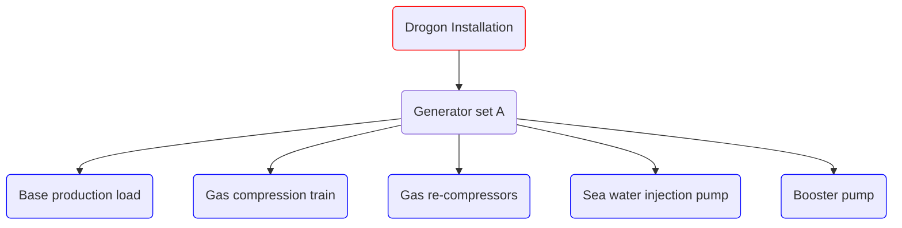

import CodeLinesFromFile from "../../../../src/components/CodeLinesFromFile";
import CodeBlock from '@theme/CodeBlock';
import yamlModel from '!!raw-loader!@examples/drogon/model.yaml';
import genset from '!!raw-loader!@examples/drogon/genset.csv';
import wi200barSSP from '!!raw-loader!@examples/drogon/wi_200bar_ssp.csv';
import drogonMean from '!!raw-loader!@examples/drogon/drogon_mean.csv';

# Drogon model example

The Drogon example is based on a synthetic data set.

On the installation, the following consumers are identified:

The results of a performed characterization of the equipment are listed below:

| Consumer                         |Type                | Description                                                                                                                                              |
|----------------------------------|--------------------|----------------------------------------------------------------------------------------------------------------------------------------------------------|
| Generator set A                |Generator set       | Variable fuel consumer with electricity to fuel function                                                                                                 |
| Base production load             |Power consumer      | Constant load - 9 MW                                                                                                                                    |
| Gas compression train         |Power consumer      |  Variable consumption depending on produced gas rate                                                                      |
| Gas re-compressors         |Power consumer      |  Constant load - 2 MW                                                                      |
| Sea water injection pump         |Power consumer      | Variable consumption depending on water injection rate                                               |
| Booster pump       |Power consumer      | Constant load - 2 MW |

## YAML model overview

The YAML model consists of the following components:

* Time series input
* Facility inputs
* Model inputs
* Fuel type input
* Installation topography

The skeleton of the YAML file looks like the following:

~~~~~~~~yaml
TIME_SERIES: 
    <placeholder>
FACILITY_INPUTS:
    <placeholder>
MODELS:
    <placeholder>
FUEL_TYPES:
    <placeholder>
INSTALLATIONS:
    <placeholder>
~~~~~~~~

## TIME_SERIES

The reservoir variables. In this case the file is called: `drogon_mean.csv`. 
<CodeLinesFromFile start={1} end={4} language="yaml">{yamlModel}</CodeLinesFromFile>

## FACILITY_INPUTS

In this case, the compressors are not specified in this section as [GENERIC COMPRESSOR CHARTS](/about/modelling/setup/models/compressor_modelling/compressor_charts/index.md). Thus, the pump chart and generator set will be the only facility components specified within this section. 

The pump will be single speed, meaning that the pump type will be `PUMP_CHART_SINGLE_SPEED`. The generator set will be a tabulated, where power consumption will be linked to fuel gas utilised.
<CodeLinesFromFile start={5} end={15} language="yaml">{yamlModel}</CodeLinesFromFile>

## MODELS

The model section will contain the fluid model, the compressor chart and the subsequent compressor model. 
Peng-Robinson (PR) will be the selected equation of state in this example. 

This example will use a generic compressor chart. In this case, a generic compressor chart from input will utilised. Here, the a "typical" chart will be shifted to match the input head and rate data. See [GENERIC COMPRESSOR CHARTS](../setup/models/compressor_modelling/compressor_charts/index.md) for more details. When a generic chart is used, a polytropic efficiency needs to be specified. This value will be constant throughout the use, in this case a value of 0.8 is used.

A [SIMPLIFIED_VARIABLE_SPEED_COMPRESSOR_TRAIN](/about/modelling/setup/models/compressor_modelling/compressor_models_types/simplified_variable_speed_compressor_train_model.md) model is used in this example, as this is necessary when a generic chart is used. Instead of manually specifying the number of compression stages, a `MAXIMUM_PRESSURE_RATIO_PER_STAGE` of 3.5 is defined. This will automatically distribute the pressure increase amongst the compression train so that no pressure ratio per compression stage will be above 3.5. 
<CodeLinesFromFile start={16} end={45} language="yaml">{yamlModel}</CodeLinesFromFile>

## FUEL_TYPES

The fuel gas has a CO2 factor of 2.416.
<CodeLinesFromFile start={46} end={51} language="yaml">{yamlModel}</CodeLinesFromFile>

## INSTALLATIONS

In the `INSTALLATIONS` section, the previously defined models and facility inputs are further defined. Here the hydrocarbon export can be specified. This is used in order to get a hydrocarbon-to-emission value. In this case, it is assumed that this facility exports oil (`OIL_PROD`) and gas (`GAS_PROD`).
<CodeLinesFromFile start={52} end={56} language="yaml">{yamlModel}</CodeLinesFromFile>

### GENERATORSETS

There is one generator set used in this example - `Generator set A`. This is a tabular relationship between power generated/consumed and fuel gas burnt.
Under this category, all consumers that utilise electricity are defined. In this case scenario, all pumps and compressors are electrically driven; thus, all consumers will be specified under this category.
<CodeLinesFromFile start={57} end={61} language="yaml">{yamlModel}</CodeLinesFromFile>

#### PUMPS

The previously defined variable speed pump (in `FACILITY_INPUTS`) is put into further defined with suction and discharge pressures, rates and operational settings.

Here, a system of pumps is used. This means that instead of a single pump being used to deliver the respective injection rate, a system of pumps is defined. In this case, a system of two pumps will be used. If the first pump is unable to deliver the requested head or rate, a second pump will be additionally used and the rate will be split across the pump system.
As only one pump has been defined, the same pump model will be used for each train. As each pump is identical, the rate will be equally split across the train when needed (this is to ensure the highest pump efficiency - see [PUMP MODELLING](../setup/installations/pump_models_in_calculations) for more details.)

A fluid density of 1025 kg/m3 is used, with a suction and discharge pressure of 12 and 200 bar respectively.
<CodeLinesFromFile start={62} end={83} language="yaml">{yamlModel}</CodeLinesFromFile>

#### COMPRESSORS

For the compression model, a compressor system is not used. This is due to the use of generic compressor charts. As the generic charts are shifted from input data there is no need for an additional compression train. No matter what rate/head values are inputted here, the generic chart is shifted so that all operational points will be within the operational envelope of the compressor.

Here, 13 bar and 421 bar is specified for the suction and discharge pressure respectively.
<CodeLinesFromFile start={85} end={97} language="yaml">{yamlModel}</CodeLinesFromFile>

#### BASE-LOAD

Three different constant-loads are specified in this section. These being the booster pump, the re-compressors and then the general facility base-load. 
<CodeLinesFromFile start={99} end={113} language="yaml">{yamlModel}</CodeLinesFromFile>

## Full Model
<CodeBlock title="model.yaml" language="yaml">{yamlModel}</CodeBlock>

## Input Data

### Facility resources
<CodeBlock title="genset.csv">{genset}</CodeBlock>
<CodeBlock title="wi_200bar_ssp.csv">{wi200barSSP}</CodeBlock>

### Timeseries resources
<CodeBlock title="drogon_mean.csv">{drogonMean}</CodeBlock>
