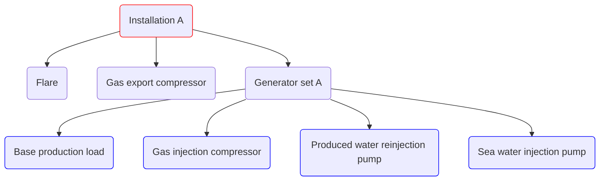

import CodeLinesFromFile from "../../../../src/components/CodeLinesFromFile";
import CodeBlock from '@theme/CodeBlock';
import compressorSampledCsv from '!!raw-loader!./simple/compressor_sampled.csv';
import compressorSampledWithTurbineCsv from '!!raw-loader!./simple/compressor_sampled_with_turbine.csv';
import genset from '!!raw-loader!./simple/genset.csv';
import productionData from '!!raw-loader!./simple/production_data.csv';
import pumpChart from '!!raw-loader!./simple/pump_chart.csv';
import pumpSampled from '!!raw-loader!./simple/pump_sampled.csv';
import yamlModel from '!!raw-loader!./simple/model.yaml';

# Simple model example
The following is an example with one installation called `Installation A` that exports oil (`OIL_PROD`) and gas (`GAS_PROD`).
The installation emits CO2.

On this installation, the following components are identified:

The results of a performed characterization of the equipment are listed below:

| Consumer                         |Type                | Description                                                                                                                                              |
|----------------------------------|--------------------|----------------------------------------------------------------------------------------------------------------------------------------------------------|
| Generator set A                  |Generator set       | Variable fuel consumer with electricity to fuel function                                                                                                 |
| Base production load             |Power consumer      | Constant load 11.8 MW                                                                                                                                    |
| Gas injection compressor         |Power consumer      | Variable consumption depending on gas injection rate and lift gas rate                                                                                   |
| Produced water reinjection pump |Power consumer      | Variable consumption depending on water production rate and water injection rate. The pump suction pressure is 10 bar and discharge pressure is 200 bar. |
| Sea water injection pump         |Power consumer      | Variable consumption depending on a complex combination on water injection rate and water production rate                                                |
| Flare                            |Direct fuel consumer| Before 1.1.2005: Constant fuel rate 10000 Sm3/day, From 1.1.2005: Constant fuel rate 7000 Sm3/day                                                        |
| Gas export compressor            |Direct fuel consumer| Variable fuel consumer depending on gas sales rate                                                                                                       |

## YAML model overview
The YAML model consist of these main components:
- Time series inputs - [TIME_SERIES](/about/references/TIME_SERIES.md)
- Facility characterization input - [FACILITY_INPUTS](/about/references/FACILITY_INPUTS.md)
- Fuel input - [FUEL_TYPES](/about/references/FUEL_TYPES.md)
- Model variables - [VARIABLES](/about/references/VARIABLES.md)
- Installation topology - [INSTALLATIONS](/about/references/INSTALLATIONS.md)

The YAML setup file looks like this:

~~~~~~~~yaml title="model.yaml"
TIME_SERIES:
  <placeholder>
FACILITY_INPUTS:
  <placeholder>
FUEL_TYPES:
  <placeholder>
VARIABLES:
  <placeholder>
INSTALLATIONS:
  <placeholder>
~~~~~~~~

We will now replace the placeholders for each of the main keywords above.

## TIME_SERIES
The reservoir variables, in this case, are found in a CSV (Comma separated file) `production_data.csv`.
We give the time-series data a name that can be referenced as variables elsewhere in the form `<NAME>:<NAME OF COLUMN>`.
See [TIME_SERIES](/about/references/TIME_SERIES.md) for further details.

<CodeLinesFromFile title="model.yaml" start={1} end={4} language="yaml">{yamlModel}</CodeLinesFromFile>

## FACILITY_INPUTS
We specify CSV input data for processing equipment using FACILITY_INPUTS. This is used for generatorsets,
tabulated/sampled models and pump charts.
See [FACILITY_INPUTS](/about/references/FACILITY_INPUTS.md) for further details.

Here we define a tabulated genset, a sampled compressor, a sampled compressor driven by a turbine, a sampled pump,
and a single speed pump chart. These will be used in the final model for illustration.
Note that more complicated energy models are defined under the [MODELS-keyword](/about/references/MODELS.md).

See the input data further down to understand the input formats.

<CodeLinesFromFile title="model.yaml" start={5} end={24} language="yaml">{yamlModel}</CodeLinesFromFile>

## FUEL_TYPES
In this example there is only one [FUEL_TYPES](/about/references/FUEL_TYPES.md) - `fuel_gas`. The emissions we model with the fuel is CO2. The CO2 factor
is 2.19 kg CO2 per Sm3 fuel gas burned.

<CodeLinesFromFile title="model.yaml" start={26} end={30} language="yaml">{yamlModel}</CodeLinesFromFile>

## VARIABLES
To run the model it is recommended to specify [VARIABLES](/about/references/VARIABLES.md),
instead of hard coding values in difference places. This makes it easier to develop, maintain and understand the model
by allowing descriptive variable names and avoid duplications.

For our model, we specify the following variables:

<CodeLinesFromFile title="model.yaml" start={32} end={49} language="yaml">{yamlModel}</CodeLinesFromFile>

We reference the [TIME_SERIES](#time_series) `SIM` using the column names from the CSV file. Here we use for example
`SIM:OIL_PROD` (Field Oil Production Rate) `SIM:GAS_PROD` (Field Gas Sales Rate).

:::tip
It is possible to specify if-else conditions by multiplying with boolean values.
This has been done in the $var.sea_water_injection_rate_m3_per_day variable example above.
:::

## INSTALLATION

An installation is composed of hydrocarbon export, a default fuel for that installation and consumers in the form
of generatorsets (with electric sub-consumers), and direct fuel consumers.

We specify:
- `NAME`: the installation name
- `HCEXPORT`: Hydrocarbon export in Sm3/day by referring to the variable specified under [VARIABLES](#variables) above.
- `FUEl`: Default fuel specified in [FUEL_TYPES](#fuel_types) above.

~~~~~~~~yaml
INSTALLATIONS:
  - NAME: Installation A
    HCEXPORT: $var.hydrocarbon_export_sm3_per_day
    FUEL: fuel_gas
    GENERATORSETS:
      <placeholder>
    FUELCONSUMERS:
      <placeholder>
~~~~~~~~

### GENERATORSETS
There is one generator set, `Generator set A`. This has a power to fuel function defined in
[FACILITY_INPUTS](#facility_inputs) with the name `genset`. Further, the consumers getting
power from the generator set are *Base production load*, *Gas injection compressor*, *Produced water re-injection pump*
and *Sea-water injection pump*. The setup for `Generator set A` thus becomes:

~~~~~~~~yaml
    GENERATORSETS:
      - NAME: Generator set A
        ELECTRICITY2FUEL: genset
        CATEGORY: TURBINE-GENERATOR
        CONSUMERS:
          - NAME: Base production load
            CATEGORY: BASE-LOAD
            ENERGY_USAGE_MODEL:
              <placeholder>
          - NAME: Gas injection compressor
            CATEGORY: COMPRESSOR
            ENERGY_USAGE_MODEL:
              <placeholder>
          - NAME: Produced water reinjection pump
            CATEGORY: PUMP
            ENERGY_USAGE_MODEL:
              <placeholder>
          - NAME: Sea water injection pump
            CATEGORY: PUMP
            ENERGY_USAGE_MODEL:
              <placeholder>
~~~~~~~~

### FUELCONSUMERS
The direct fuel consumers are **Flare** and **Gas export compressor**.
~~~~~~~~yaml title="model.yaml"
    FUELCONSUMERS:
      - NAME: Flare
        CATEGORY: FLARE
        ENERGY_USAGE_MODEL:
          <placeholder>
      - NAME: Gas export compressor
        CATEGORY: COMPRESSOR
        ENERGY_USAGE_MODEL:
          <placeholder>
~~~~~~~~

## ENERGY_USAGE_MODEL
We will now fill in the final placeholders with detailed [ENERGY_USAGE_MODEL](/about/references/ENERGY_USAGE_MODEL.md)s.

`Base production load` has a constant load of 11.8 MW:

<CodeLinesFromFile title="model.yaml" start={60} end={64} language="yaml">{yamlModel}</CodeLinesFromFile>

`Gas injection compressor` is represented by a tabulated (sampled) energy usage model defining the relationship
between the gas injection rate [Sm3/day] and the corresponding power requirement. The gas rate is already defined
in the variable [gas_injection_rate_sm3_per_day](#variables) as `SIM;GAS_INJ {+} SIM;GAS_LIFT`:

<CodeLinesFromFile title="model.yaml" start={65} end={72} language="yaml">{yamlModel}</CodeLinesFromFile>

`Produced water reinjection pump` is variable and its energy function is dependent on the field's water
production rate (`WATER_PROD`) that is set in the variable [produced_water_reinjection_condition](#variables) as `SIM;WATER_PROD`.
The pump only runs when the variables [produced_water_reinjection_condition](#variables) evaluates to true as `SIM;WATER_PROD > 1500`.
This is when the water production is above 1500 Sm3/day. Fluid density, suction pressure and discharge pressure
is also defined:

<CodeLinesFromFile title="model.yaml" start={73} end={82} language="yaml">{yamlModel}</CodeLinesFromFile>

`Sea water injection pump` has an energy function that is dependent on the seawater injection rate.
This rate is not modeled explicitly in the reservoir input source, but it may be computed
from the injection (`WATER_INJ`) and production (`WATER_PROD`) rate by the following rules:

- In general, the seawater injection rate (`SEAWATER_INJ`), is the difference between injected and
  produced water: `SEAWATER_INJ = WATER_INJ - WATER_PROD`.

- When the produced water rate is below 1500 SM3/day, this goes directly to sea, such that
  `SEAWATER_INJ = WATER_INJ` when `WATER_PROD < 1500`.

- When the produced water rate is between 17000 and 18500 SM3/day, everything above 17000 SM3/day
  goes directly to the sea, thus `SEAWATER_INJ = WATER_INJ - 17000` when `17000 < WATER_PROD < 18500`.

This is specified as the variable [sea_water_injection_rate_m3_per_day](#variables) above and is defined as:

The model is specified:

<CodeLinesFromFile title="model.yaml" start={83} end={90} language="yaml">{yamlModel}</CodeLinesFromFile>

The flare is changing on the 1st of January 2005. Therefore, we need to use a different constant
fuel consumption value before and after this date. This is done using the variable [flare_fuel_rate_sm3_day](#variables)
above.

The model is specified:

<CodeLinesFromFile title="model.yaml" start={92} end={96} language="yaml">{yamlModel}</CodeLinesFromFile>

Gasexport is a variable fuel consumer whose energy function depends on the field gas sales rate (`GAS_PROD`) defined
in the variable [gas_export_rate_sm3_per_day](#variables) as `SIM;GAS_PROD`. Even though it is not used in the eCalc model, suction and discharge pressure needs to be specified in order for the model to run. 

The model is specified:

<CodeLinesFromFile title="model.yaml" start={97} end={104} language="yaml">{yamlModel}</CodeLinesFromFile>

## Full eCalc YAML model

<CodeBlock title="model.yaml" language="yaml">{yamlModel}</CodeBlock>

## Input files
<CodeBlock title="compressor_sampled.csv">{compressorSampledCsv}</CodeBlock>
<CodeBlock title="compressor_sampled_with_turbine.csv">{compressorSampledWithTurbineCsv}</CodeBlock>
<CodeBlock title="genset.csv">{genset}</CodeBlock>
<CodeBlock title="pump_chart.csv">{pumpChart}</CodeBlock>
<CodeBlock title="pump_sampled.csv">{pumpSampled}</CodeBlock>
<CodeBlock title="production_data.csv">{productionData}</CodeBlock>
