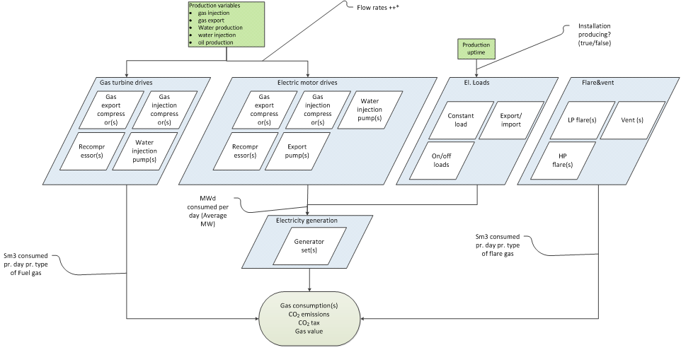

# File format

The setup file is written in YAML format and needs to follow a strict pattern which consists of several levels specified by indentation. The indentation is very important. It is recommended to use an indentation of 2 spaces per level. At each level, there might be both required and optional keywords.

## Setup file syntax

The overall system in eCalc is that the user defines inputs from subsurface and facility and
then establishes a model between these.

On the top level, the required keywords are [FACILITY_INPUTS](../../../references/keywords/FACILITY_INPUTS) which defines the input from facility characterization, [TIME_SERIES](../../../references/keywords/TIME_SERIES.md) which defines time-dependant input parameters (e.g. reservoir profiles), [FUEL_TYPES](../../../references/keywords/FUEL_TYPES) which defines the various fuel types used in the system, and [INSTALLATIONS](../../../references/keywords/INSTALLATIONS) which is the top node defining the system of energy consumers. [MODELS](../../../references/keywords/MODELS) is optional and may be used for multi-level energy usage models.

Documentation about how to set up each of these fields are found here, respectively:

- [TIME_SERIES](../../..//references/keywords/TIME_SERIES.md): List of input sources, CSV-files, containing all time series data including the
  reservoir variables.
- [FACILITY_INPUTS](../../../references/keywords/FACILITY_INPUTS): List of input files from facility characterization. Typically, this can be
  characteristics for an element in a consumer system or characteristics for a generator set.
  Also, if fuel price or/and CO2 tax is of type `VARIABLE_FUEL_PRICE` or
  `VARIABLE_EMISSION_TAX`, these files should also be put here. These are later used as input
  to the energy functions for each consumer. Some may also be used as energy functions directly.
- [FUEL_TYPES](../../../references/keywords/FUEL_TYPES): Defining the fuel types being used in the model and the corresponding
  emissions.
- [MODELS](../../../references/keywords/MODELS): Used for multi-level models, one model may refer to other models from either
  [MODELS](../../../references/keywords/MODELS) or [FACILITY_INPUTS](../../../references/keywords/FACILITY_INPUTS)
- [VARIABLES](../../../references/keywords/VARIABLES): Used for defining variables to be used in expressions throughout the YAML file
- [INSTALLATIONS](../../../references/keywords/INSTALLATIONS): Defining the system of energy consumers on each installation
  (e.g. platform or mobile unit).

An eCalc model may contain one or several installations. Each installation has a set of specifications
(e.g. fuel type, hydrocarbon export, ...) and specifications of the system of consumers.

Emissions are emitted when fuel is burned. Thus, the first sublevel of consumers for an installation,
are the fuel burners. As the figure below shows, there are three main types of fuel burners:
- Electricity generation (generator sets),
- Turbine-driven processes,
- Flare/vent/other non reservoir dependent burners/emitters.

In eCalc under each installation, there is one keyword ([GENERATORSETS](../../../references/keywords/GENERATORSETS.md))
specifying the generator sets and one keyword ([FUELCONSUMERS](../../../references/keywords/FUELCONSUMERS.md))
specifying processes that require fuel directly (turbine-driven processes and flare/vent).

The processes with electrical motor drives and other electrical loads are modeled at the sublevel
under [GENERATORSETS](../../../references/keywords/GENERATORSETS.md).

:::tip Comments
Comments are supported anywhere in the yml and csv files by using '#' to indicate the start of a comment.
All data after a '#' on the same line is ignored. If '#' is used at the beginning of the file, the
first line without a preceding '#' is used as the header.
:::
## Examples

### YAML format example
~~~~~~~~yaml
TIME_SERIES:
  - FILE:
    TYPE:
    NAME:

FACILITY INPUTS:
  - FILE:
    TYPE:
    NAME:

FUEL_TYPES:
  - NAME:
    FACTOR:

MODELS:
  - NAME:
  - TYPE:

VARIABLES:
  <variable_name>
    VALUE: <expression>

INSTALLATIONS:
  - NAME:
    HCEXPORT:
    FUEL:
    GENERATORSETS:
      - NAME:
        ELECTRICITY2FUEL:
        CATEGORY:
        CONSUMERS:
          - NAME:
            CATEGORY:
            ENERGY_USAGE_MODEL:

~~~~~~~~

### Full examples

Examples are an excellent way to quickly get an overview of the syntax. Check them out [here](../../examples/index.md).
