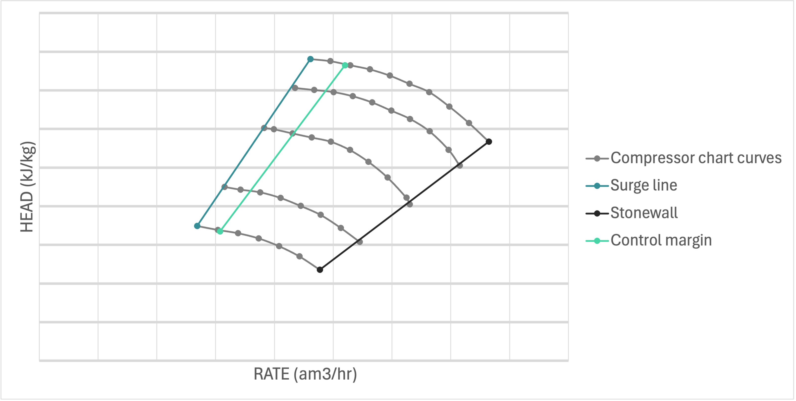
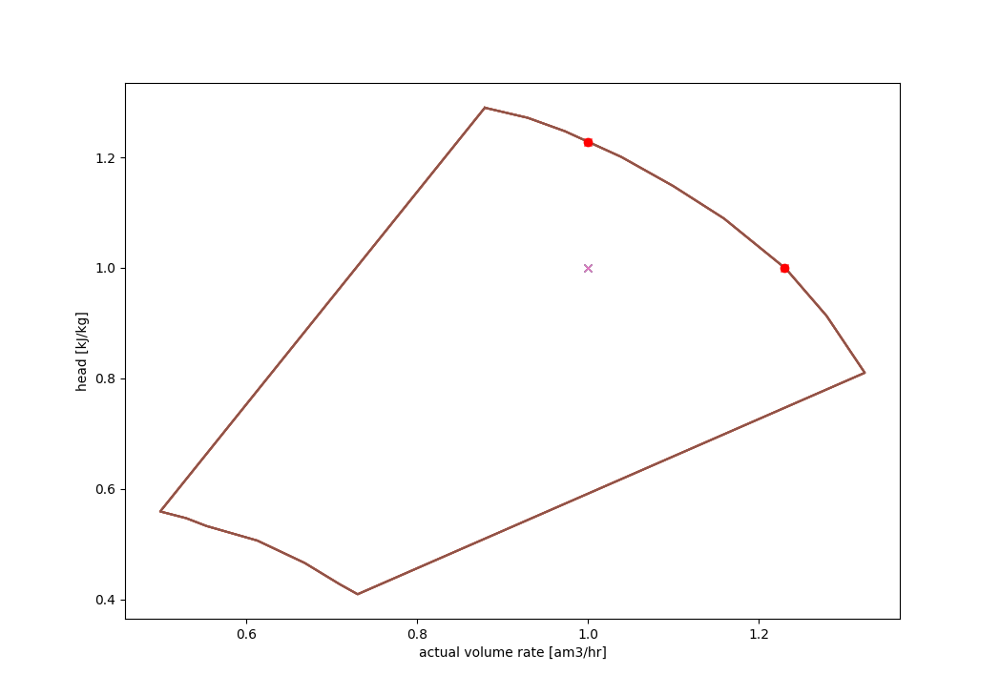

# Compressor chart
The compressor chart is used to set up a model of each compressor. eCalc™ currently support four ways to set up a
compressor chart

- Predefined single speed chart
- Predefined variable speed chart
- Generic compressor chart with a specified design point
- Generic compressor chart which is automatically adjusted to have capacity for the input data

## User defined single speed compressor chart

The single speed chart type allows a single compressor curve for one speed, using the keyword [CURVE](/about/references/CURVE.md)

### Format
~~~~~~~~yaml
MODELS:
  - NAME: <name of chart, for reference>
    TYPE: COMPRESSOR_CHART
    CHART_TYPE: SINGLE_SPEED
    UNITS:
      RATE: <rate unit, currently only AM3_PER_HOUR supported>
      HEAD: <polytropic head unit, M, KJ_PER_KG, JOULE_PER_KG supported>
      EFFICIENCY: <polytropic efficiency unit, FRACTION and PERCENTAGE.>
    CURVE:
      - SPEED: <shaft speed for this curve, a number>
        RATE: <list of rate values for this chart curve>
        HEAD: <list of polytropic head values for this chart curve>
        EFFICIENCY: <list of polytropic efficiency values for this chart curve>
~~~~~~~~

### Example
~~~~~~~~yaml
MODELS:
  - NAME: predefined_single_speed_compressor_chart
    TYPE: COMPRESSOR_CHART
    CHART_TYPE: SINGLE_SPEED
    UNITS:
      RATE: AM3_PER_HOUR
      HEAD: M
      EFFICIENCY: FRACTION
    CURVE:
      - SPEED: 7500
        RATE: [2900, 3503, 4002, 4595.0]
        HEAD: [8412.9, 7996, 7363, 6127]
        EFFICIENCY: [0.72, 0.75, 0.74, 0.70]
~~~~~~~~

:::tip Tip
It is also possible to input single speed compressor chart as csv file.

#### Format

~~~~~~~~yaml
CURVE:
  FILE: <csv file with single speed compressor chart>
~~~~~~~~

#### Example

~~~~~~~~yaml
CURVE:
  FILE: compressor_chart_single_speed.csv
~~~~~~~~
:::
## User defined variable speed compressor chart
The variable speed chart type allows a fully defined compressor chart with data for two or more speeds, using the keyword [CURVES](/about/references/CURVES.md). The upper and
lower speed curves will be interpreted as the speed capacity limits for the chart. 
Whilst the lowest rate points on each of the upper and lower speed curves will define the minimum flow line for the compressor. 

Additionally, there is functionality to define a control line which behaves as an alternate to the minimum flow line. This means that your input will be 'cropped' to only include points to the right of the control line - modelling recirculation (`ASV`) from the correct control line. 
See `Surge control margin for variable speed compressor chart` for more details.

The figure shows an example of a user defined variable speed compressor chart, showing the individual curves for each speed,
the surge line, the control margin line, and the stonewall.

:::note
Using a variable speed compressor chart as input essentially does the same as if a process simulation tool was used to
create an energy function. It has been verified to be close to identical to Unisim within 2% accuracy (smaller
differences in density arise from differences in PVT assumptions and calculations).
:::
### Format
~~~~~~~~yaml
MODELS:
  - NAME: <name of chart, for reference>
    TYPE: COMPRESSOR_CHART
    CHART_TYPE: VARIABLE_SPEED
    UNITS:
      RATE: <rate unit, currently only AM3_PER_HOUR supported>
      HEAD: <polytropic head unit, M, KJ_PER_KG, JOULE_PER_KG supported>
      EFFICIENCY: <polytropic efficiency unit, FRACTION and PERCENTAGE.>
    CURVES:
      - SPEED: <shaft speed for this curve, a number>
        RATE: <list of rate values for this chart curve>
        HEAD: <list of polytropic head values for this chart curve>
        EFFICIENCY: <list of polytropic efficiency values for this chart curve>
      - SPEED: <shaft speed for this curve, a number>
        RATE: <list of rate values for this chart curve>
        HEAD: <list of polytropic head values for this chart curve>
        EFFICIENCY: <list of polytropic efficiency values for this chart curve>
      - ... and so forth for all chart curves. Minimum two curves needed.
~~~~~~~~

### Example
~~~~~~~~yaml
MODELS:
  - NAME: predefined_variable_speed_compressor_chart
    TYPE: COMPRESSOR_CHART
    CHART_TYPE: VARIABLE_SPEED
    UNITS:
      RATE: AM3_PER_HOUR
      HEAD: M
      EFFICIENCY: FRACTION
    CURVES:
      - SPEED: 7500
        RATE: [2900, 3503, 4002, 4595.0]
        HEAD: [8412.9, 7996, 7363, 6127]
        EFFICIENCY: [0.72, 0.75, 0.74, 0.70]
      - SPEED: 9886
        RATE: [3708, 4502, 4993.6, 5507, 5924]
        HEAD: [13845, 13182, 12425, 11276, 10054]
        EFFICIENCY: [ 0.72, 0.75, 0.748, 0.73, 0.70]
      - SPEED: 10767
        RATE: [4052, 4500, 4999, 5492, 6000, 6439,]
        HEAD: [16447, 16081, 15546, 14640, 13454, 11973,]
        EFFICIENCY: [0.72, 0.73, 0.74, 0.74, 0.72, 0.70]
~~~~~~~~

:::tip Tip
It is also possible to input variable speed compressor chart as csv file.

#### Format

~~~~~~~~yaml
CURVES:
  FILE: <csv file with variable speed compressor chart>
~~~~~~~~

#### Example

~~~~~~~~yaml
CURVES:
  FILE: compressor_chart_variable_speed.csv
~~~~~~~~
:::
## Generic compressor chart with predefined design point
The generic compressor chart used is an "average" chart of compressors used on the NCS and cannot be expected to be equal to
the actual chart for a compressor which has been designed and delivered. However, it can be a good first estimation of
how a chart may be for a future process not yet in the design phase. 

This chart will not replace any future compressor curves and it may not be accurate in comparison to the final compressor curve; however, it is a good method to capture the major effects (such as  `ASV` (anti-surge valve) recirculation). 
With this method it is possible to view how a "typical" compressor curve would react a large spread in the data set. If the design point is set within the middle of the data spread, points with rates lower than the minimum flow will have some recirculation; whilst, too high or unrealistic rates will not be solved. This is an essential difference in comparison to the generic chart with its design point calculated from input data (which is covered in `Generic compressor chart with design point calculated from input data`), which will shift the entire compressor curve to solve for even the highest rate and head points. 

Unified generic compressor chart:

The compressor chart is created by scaling the unified generic compressor chart in the figure above with a
[DESIGN_RATE](/about/references/DESIGN_RATE.md) and a [DESIGN_HEAD](/about/references/DESIGN_HEAD.md).
The generic compressor chart is currently accompanied by a fixed
[POLYTROPIC_EFFICIENCY](/about/references/POLYTROPIC_EFFICIENCY.md) (polytropic efficiency
variations within the chart may be supported in the future).

The [UNITS](/about/references/UNITS.md) for the `RATE`, `HEAD` and `EFFICIENCY` must also be defined. Note that
the only rate unit available here is *am3/hr* which is NOT EQUAL to *Sm3/hr*. The units *am3/hr* refers to the 
volumetric rate at inlet conditions (inlet pressure and temperature), and it will differ from the inputted standard
rates due to the difference in density. The design polytropic head is given in either *kJ/kg*, *m* or J/kg.

### Format
~~~~~~~~yaml
MODELS:
  - NAME: <name of chart, for reference>
    TYPE: COMPRESSOR_CHART
    CHART_TYPE: GENERIC_FROM_DESIGN_POINT
    POLYTROPIC_EFFICIENCY: <polytropic efficiency of the compressor (fixed number)>
    DESIGN_RATE: <design rate>
    DESIGN_HEAD: <design polytropic head>
    UNITS:
      RATE: <rate unit, currently only AM3_PER_HOUR supported>
      HEAD: <polytropic head unit, M, KJ_PER_KG, JOULE_PER_KG supported>
      EFFICIENCY: <polytropic efficiency unit, FRACTION and PERCENTAGE.>
~~~~~~~~

### Example
~~~~~~~~yaml
MODELS:
  - NAME: generic_from_design_point_compressor_chart
    TYPE: COMPRESSOR_CHART
    CHART_TYPE: GENERIC_FROM_DESIGN_POINT
    POLYTROPIC_EFFICIENCY: 0.75
    DESIGN_RATE: 7000
    DESIGN_HEAD: 50
    UNITS:
      RATE: AM3_PER_HOUR
      HEAD: KJ_PER_KG
      EFFICIENCY: FRACTION
~~~~~~~~

For this method it is important to note that only `Simplified variable speed compressor train model` is supported. 

### Example
~~~~~~~~yaml
MODELS:
  - NAME: generic_compression_train_design_point
    TYPE: SIMPLIFIED_VARIABLE_SPEED_COMPRESSOR_TRAIN
    FLUID_MODEL: sample_fluid
    PRESSURE_CONTROL: UPSTREAM_CHOKE
    COMPRESSOR_TRAIN:
      STAGES:
        - COMPRESSOR_CHART: generic_from_design_point_compressor_chart
          INLET_TEMPERATURE: 30
~~~~~~~~

## Generic compressor chart with design point calculated from input data

The generic chart from input is also based on the unified generic compressor chart:

However, in this case the design point is not specified when setting up the model, instead it is estimated at run time and is entirely based on the inputted data set. 
An algorithm is used to set a design point such that all the input data is within the capacity. 
Even if there is a large spread in the data, all data points will solve. High rate/head data points will just be covered by the curve; whilst low rate points outside the minimum flow point will have recirculation. 
The generic compressor chart is currently accompanied by a fixed
[POLYTROPIC_EFFICIENCY](/about/references/POLYTROPIC_EFFICIENCY.md) (polytropic efficiency
variations within the chart may be supported in the future).

The [UNITS](/about/references/UNITS.md) for the `EFFICIENCY` must also be defined.

This method has one major potential downside in comparison to the `Generic compressor chart with predefined design point`. As all data points will be covered by the compressor curve, if there is an extremely large or unrealistic head or rate value, the other more "normal" data points will be impacted and will either result in a large head adjustment (via upstream/downstream choking) or it will have a large recirculation rate. This has the potential to skew the entire data set solely due to one unrealistic data point.  Thus, if this generic chart is utilised it is important to make sure that unrealistic data is filtered out.

### Format
~~~~~~~~yaml
MODELS:
  - NAME: <name of chart, for reference>
    TYPE: COMPRESSOR_CHART
    CHART_TYPE: GENERIC_FROM_INPUT
    POLYTROPIC_EFFICIENCY: <polytropic efficiency of the compressor (fixed number)>
    UNITS:
      EFFICIENCY: <polytropic efficiency unit, FRACTION and PERCENTAGE.>
~~~~~~~~

### Example
~~~~~~~~yaml
MODELS:
  - NAME: generic_from_input_compressor_chart
    TYPE: COMPRESSOR_CHART
    CHART_TYPE: GENERIC_FROM_INPUT
    POLYTROPIC_EFFICIENCY: 0.75
    UNITS:
      EFFICIENCY: FRACTION
~~~~~~~~

## Surge control margin for variable speed compressor chart

For a variable speed compressor chart it is possible to add a surge control margin. This is currently done by giving a
fraction or percentage as input. The control margin is used to calculate the increase in minimum flow, i.e. as a percentage 
or fraction of the rate difference between minimum- and maximum flow, for the given speed. The increase in minimum
flow is calculated individually for each speed curve. The corresponding head and efficiency values for the new minimum flow rate
is found by interpolation along the speed curves. The same compressor chart can be used for multiple compressor stages,
but with different surge control margins. Hence, the surge control margin is defined when setting up the stages in a
[`Variable speed compressor train model`](/about/modelling/setup/models/compressor_modelling/compressor_models_types/variable_speed_compressor_train_model.md) or [`Variable speed compressor train model with multiple streams and pressures`](/about/modelling/setup/models/compressor_modelling/compressor_models_types/variable_speed_compressor_train_model_with_multiple_streams_and_pressures.md).

### Format
~~~~~~~~yaml
MODELS:
  - NAME: <model name>
    TYPE: VARIABLE_SPEED_COMPRESSOR_TRAIN
    FLUID_MODEL: <reference to fluid model, must be defined in [MODELS]
    COMPRESSOR_TRAIN:
      STAGES:
        - INLET_TEMPERATURE: <inlet temperature in Celsius for stage>
          COMPRESSOR_CHART: <reference to compressor chart model for first stage, must be defined in MODELS or FACILITY_INPUTS>
          CONTROL_MARGIN: <Default value is zero>
          CONTROL_MARGIN_UNIT: <FRACTION or PERCENTAGE, default is PERCENTAGE>
~~~~~~~~