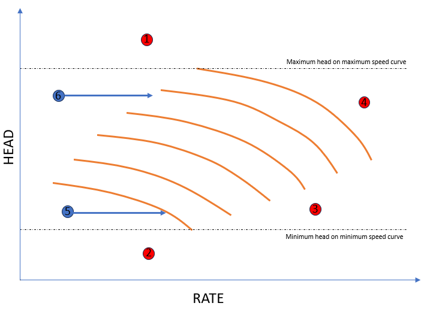

In this model all compressors in the train have the same speed, and the model is build on a forward model of
the fluid properties/state where speed is a parameter. Then the speed is iterated until the discharge pressure of the
outlet is equal to the requested discharge pressure. If the resulting discharge pressure is not low enough to meet the 
requested discharge pressure by iterating on speed only, an attempt is made to find a solution using the defined
[Fixed speed pressure control](/about/modelling/setup/models/compressor_modelling/fixed_speed_pressure_control/index.md) with the speed fixed at the minimum speed.

This model only supports `User defined variable speed compressor chart`.

In addition, the following keywords are required:
- [FLUID MODEL](/about/modelling/setup/models/fluid_model.md)
- [CONTROL_MARGIN](/about/references/CONTROL_MARGIN.md) and [CONTROL_MARGIN_UNIT](/about/references/CONTROL_MARGIN_UNIT.md) for each compressor stage in the train

**Changed in version 9.0:** CONTROL_MARGIN and CONTROL_MARGIN_UNIT are required

 

**Control mechanisms**

The variable speed compressor train model has a set of automatic control mechanisms. The figure below shows several operational points (rate/head) outside a variable speed compressor chart.

The points will be treated as follows:

1. Points with head above the maximum head on the maximum speed curve will be out of capacity.
1. Points with head below the minimum head on the minimum speed curve will be out of capacity.
1. Points below the stone wall will be out of capacity.
1. Points above the maximum speed curve will be out of capacity.
1. Points where the flow is below the minimum flow at the minimum speed curve will be moved to the minimum speed curve by increasing the rate using the ASV of the compressor.
1. Points where the flow is below the surge line of the compressor will be moved to the surge line of the compressor by increasing the rate using the ASV of the compressor.

**Format**

The model is defined under the main keyword [MODELS](/about/references/MODELS.md) in the format

~~~~~~~~yaml
MODELS:
  - NAME: <model name>
    TYPE: VARIABLE_SPEED_COMPRESSOR_TRAIN
    FLUID_MODEL: <reference to fluid model>
    COMPRESSOR_TRAIN:
      STAGES:
        - INLET_TEMPERATURE: <inlet temperature in Celsius for stage>
          COMPRESSOR_CHART: <reference to compressor chart model for first stage, must be defined in MODELS or FACILITY_INPUTS>
          CONTROL_MARGIN: <Surge control margin for the compressor stage. Set to 0.0 if no margin>
          PRESSURE_DROP_AHEAD_OF_STAGE: <Pressure drop before compression stage [in bar]>
          CONTROL_MARGIN_UNIT: <FRACTION or PERCENTAGE, default is PERCENTAGE>
        - INLET_TEMPERATURE: <inlet temperature in Celsius for stage>
          COMPRESSOR_CHART: <reference to compressor chart model for second stage, must be defined in MODELS or FACILITY_INPUTS>
          CONTROL_MARGIN: <Surge control margin for the compressor stage. Set to 0.0 if no margin>
          PRESSURE_DROP_AHEAD_OF_STAGE: <Pressure drop before compression stage [in bar]>
          CONTROL_MARGIN_UNIT: <FRACTION or PERCENTAGE, default is PERCENTAGE>
        - ... and so forth for each stage in the train
    SHAFT: <Optional reference to a SHAFT model for mechanical efficiency>
    MAXIMUM_POWER: <Optional constant MW maximum power the compressor train can require>
    POWER_ADJUSTMENT_CONSTANT: <Deprecated. Use SHAFT with MECHANICAL_EFFICIENCY instead.>
    CALCULATE_MAX_RATE: <Optional compressor train max standard rate [Sm3/day] in result if set to true. Default false. Use with caution. This will increase runtime significantly. >
    PRESSURE_CONTROL: <method for pressure control, DOWNSTREAM_CHOKE (default), UPSTREAM_CHOKE, , INDIVIDUAL_ASV_PRESSURE, INDIVIDUAL_ASV_RATE or COMMON_ASV>
~~~~~~~~

