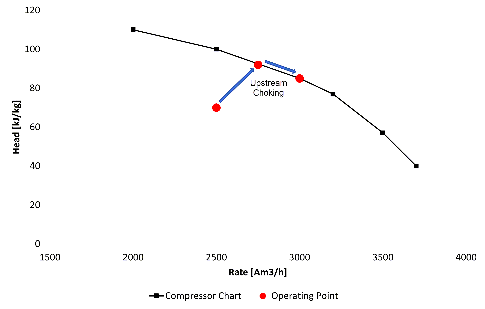
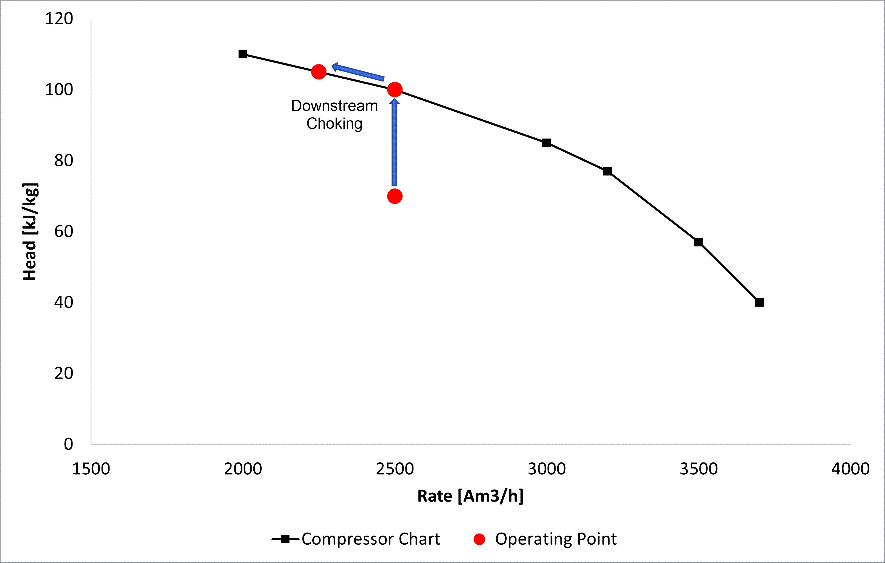
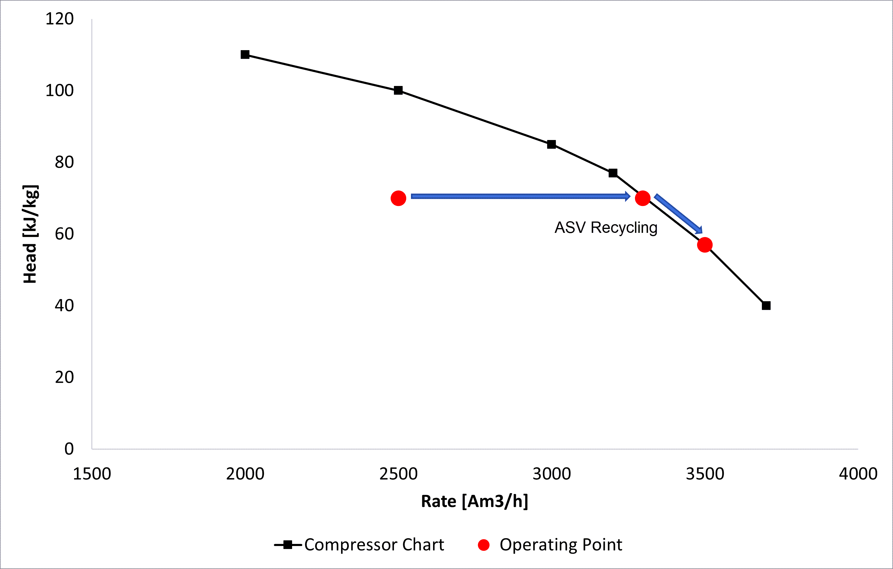
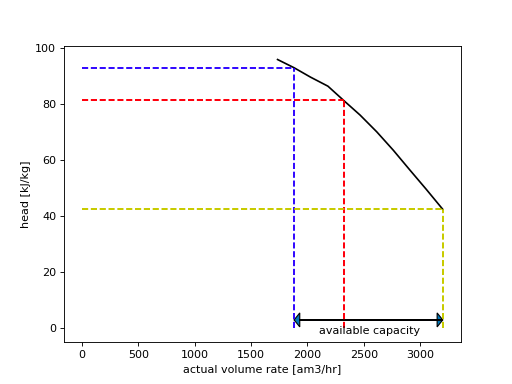

# Fixed speed pressure control

## Theory

Compressors are typically controlled by changing the rotational speed of the compressor train shaft, which can either increase or decrease the work performed. 
In the case where this is not possible ([single speed compressors](../compressor_models_types/single_speed_compressor_train_model.md)), or this is not sufficient to control the compressor, other methods of control need to be used.
In eCalc™, there are three main compressor control methods considered (aside from rotational speed control), these are:

- Upstream choking/throttling
- Downstream choking/throttling
- Anti-surge recycling

Each of these methods are used depending on the situation and placement of the compressor's operating points. 
A summary of how these methods work in practice are seen below. 
In these figures, the red point represents a singular operating point, which is shifted with the given control mechanism. The operating point first starts below the compressor curve and is then adjusted toward the curve (by either changing head or rate). The different pressure control methods will change the operating points in the follow way:
- Upstream throttling will decrease the inlet pressure, and in turn increase the head and the inlet volumetric flow rate (lower pressure = lower density = lower flow rate). 
- Downstream throttling will increase the head, as the outlet pressure is increased. There is no influence on the inlet rate in this case. 
However, when the operating points is on the compressor curve, and the head is further increased (by increasing the outlet pressure), the rate of the compressor will thus be reduced. 
- ASV recycling will simply increase the throughout of the compressor without influencing the head. 
However, when the operating points is on the compressor curve, and the mass rate through is further increased, compressor head will in turn be reduced (along the curve). 

Upstream Choking             |  Downstream Choking 
:-------------------------:|:-------------------------:|
  |   

ASV Recycling             |  
:-------------------------:|
 |

## Control modelling in eCalc™ 

In eCalc™, upstream and downstream choking is modelled as described in the [theory section](index.md#theory). 
ASV recycling on the other hand is done in three separate ways.
These three modelling methods are important for a compression train with more than one stage. This is due the fact that when each compressor stage has an individual ASV, the solution is under determined. 
For a single stage compressor, the results of these methods will be identical.
This will further be elaborated upon in the [recirculation options](index.md#pressure-control-methods---recirculation-options) section. 

Some scenarios where additional pressure control is required can be when:

- The compressor train only operates at one speed ([SINGLE_SPEED_COMPRESSOR_TRAIN](../compressor_models_types/single_speed_compressor_train_model.md)),
  and the given rate and suction pressure gives a too high discharge pressure.
- The compressor train is a [VARIABLE_SPEED_COMPRESSOR_TRAIN](../compressor_models_types/variable_speed_compressor_train_model.md),
  but it already operates at the minimum speed, and still the discharge pressure is too high.
- The compressor train is a [VARIABLE_SPEED_COMPRESSOR_TRAIN_MULTIPLE_STREAMS_AND_PRESSURES](../compressor_models_types/variable_speed_compressor_train_model_with_multiple_streams_and_pressures.md) 
  required to meet an export pressure, before compressing gas further for injection. Here the
  rotational speed required to bring the gas from inlet pressure to export pressure may be higher than the speed
  required to bring the gas from export pressure to discharge pressure. Hence, the rotational speed giving 
  the correct export pressure will give a too high discharge pressure.  

### Pressure control methods - choking options

In a situation where the rotational speed of the shaft can not be varied here are only two degrees of freedom. 
This means that if you give the suction pressure and the flow rate as input, the discharge pressure is decided by those 
two inputs. Similarly, if you give the rate and the discharge pressure as input, the suction pressure is decided by 
those two inputs. Hence, to calculate the energy usage for a given rate, suction pressure and discharge pressure, a
method for fixed speed pressure control must be defined. This can be done by a choke valve upstream or downstream 
of the compressor train, or by recirculating fluid inside the compressor train. 

Currently, there are two options for choking the pressure in eCalc™:

#### UPSTREAM_CHOKE

The suction pressure is reduced such that the resulting suction pressure after choking together with the given speed results in the required discharge pressure. 
As the inlet pressure is reduced, the inlet flow rate will also increase. 

#### DOWNSTREAM_CHOKE

The pressure is choked to the required discharge pressure after the compressor train. So the compressor's head will increase, as the compressor will compress the gas to a higher discharge pressure - which will subsequently be choked to the desired pressure.

### Pressure control methods - recirculation options

As previously mentioned, there are three different methods in eCalc™ for modelling ASV recycling. 
This is necessary as when there is more than one compressor stage, there will be individual ASVs per stage.
Thus, the problem is under determined, and there are multiple possible solutions. 
Therefore, some modelling choices must 
be done. 
There are currently three options available in eCalc™: 

- INDIVIDUAL_ASV_PRESSURE 
- INDIVIDUAL_ASV_RATE
- COMMON_ASV

:::note Note
With only one compressor stage or only one recirculation loop (common asv over the entire compressor train), 
a unique solution to how much volume to recirculate is available. 

For a single stage compressor, all recirculation options should give the same result.
:::

A further explanation of ASV recycling can be seen in the figure below.
Here, it can be seen that the head of a compressor is reduced when the rate is increased. 
This means that recirculation can reduce the 
discharge pressure for a single speed compressor.

Looking at the figure above, for an actual volume rate of 1882 am3/hr, the head is 93 kJ/kg (blue dashed line). If this head leads to a too large discharge pressure, it can be reduced by recirculation
using the anti-surge valve. As the actual flow rate through the compressor increases, the head is also reduced,
meaning that a higher actual flow rate leads to a lower discharge pressure. 

For example, by increasing the actual volume rate
to 2322 am3/hr (by recirculating 440 am3/hr through the ASV), the head is reduced to about 81.3 kJ/kg (red dashed lines)
, in turn leading to a lower discharge pressure. The head can be reduced further down to 42.5 kJ/kg at the maximum flow
rate (3201 am3/hr) for the compressor (yellow dashed lines). The difference between the flow rate entering the
compressor train and the maximum flow rate for the compressor gives the amount of additional volume that can be
recirculated through the compressor - the available capacity.

#### INDIVIDUAL_ASV_PRESSURE

The pressure ratio (discharge pressure/suction pressure) over each compressor stage is constant.
Essentially, with each time step there will be no change in the pressure ratio, but the volume flow will adjust to keep the pressure ratio constant. 

#### INDIVIDUAL_ASV_RATE

The flow rate through each compressor stage is increased with the same fraction of the available capacity in that stage.

For example, if you have a 2-stage compressor and the first stage has 500 Am3/h available capacity and the second has 400 Am3/h  available capacity. 
If the first stage increases by 25 % of the available capacity (125 Am3/h), the second stage increase by 25 % too (100 Am3/h) - given that this matches the required output. 

#### COMMON_ASV

The same volume is recirculated through the entire compressor train.
Thus, each compression stage will have the same mass throughput. 