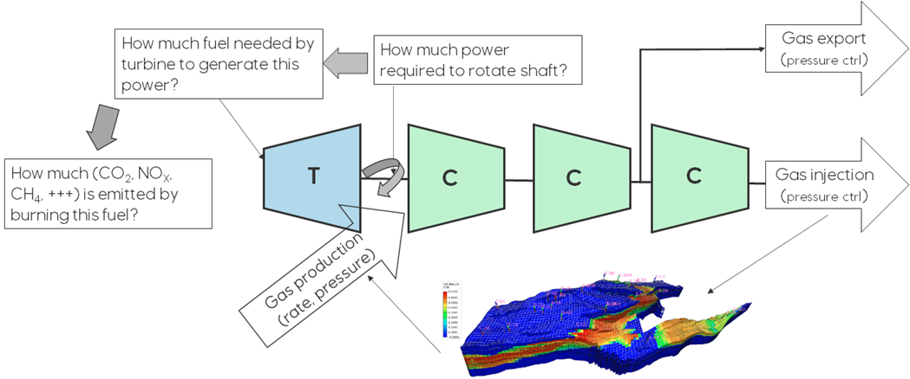

# Compressor modelling
Compressors may be single speed or variable speed, they may be stand-alone or there may be multiple compressors mounted
on a common shaft (compressor train), they may be run with an electric motor or be driven by a turbine coupled
directly to the shaft, there may be one or many compressors/compressor trains in parallel connected to a common
manifold from which the gas is distributed between these in different operational settings.

In eCalc™, single compressors and compressor trains are modeled the same way, a single compressor is just a train with
just one stage. There are multiple modeling options for compressor trains:

- [`Sampled compressor model`](/about/modelling/setup/facility_inputs/sampled_compressor_model.md): The compressor model is setup in an external tool, and this model is sampled by
  running a point set of rates and pressures which span the operational area of the compressor train. The sampled data (rates, inlet pressures, outlet pressures and total energy usage for all stages) are specified in a csv file and input to eCalc™. Note, this is **not** inputted in the `MODELS` section, rather in the [FACILITY_INPUTS](../../facility_inputs/index.md) section
- [`Single speed compressor train model`](/about/modelling/setup/models/compressor_modelling/compressor_models_types/single_speed_compressor_train_model.md): The compressor train modeling is done in eCalc™. This model requires a fluid to be specified and a polytropic compressor chart for each compressor stage. In addition, since the speed is fixed, defining a pressure control method is required. This pressure control is used to meet the required discharge pressure.
- [`Variable speed compressor train model`](/about/modelling/setup/models/compressor_modelling/compressor_models_types/variable_speed_compressor_train_model.md): The compressor train modelling is done in eCalc™. This model requires a fluid to be specified and a polytropic compressor chart for each compressor stage.
- [`Simplified variable speed compressor train model`](/about/modelling/setup/models/compressor_modelling/compressor_models_types/simplified_variable_speed_compressor_train_model.md): Model the same compressor train as the above, but is more
  lightweight in that instead of iterating to meet the requested discharge pressure, it assumes all stages has equal
  pressure fractions and solves for each stage independently. As the shaft speed is not used in the calculations, this
  model supports using generic compressor charts, see the [`Compressor charts`](/about/modelling/setup/models/compressor_modelling/compressor_charts/index.md) section.
- [`Variable speed compressor train model with multiple streams and pressures`](/about/modelling/setup/models/compressor_modelling/compressor_models_types/variable_speed_compressor_train_model_with_multiple_streams_and_pressures.md): This is a more complex model, where it is
  possible to define fluid streams going in and out at different stages in the compressor train. Also, an additional
  pressure requirement may be specified between two stages. This model is suitable in cases where for example a part of
  the fluid stream is taken out after one stage at a specified pressure for export, and the rest is further compressed
  for injection at a higher pressure.

Core theory behind the modelling of compressors in eCalc™ can be found [here](/about/modelling/theory/compressor_modelling.md).
