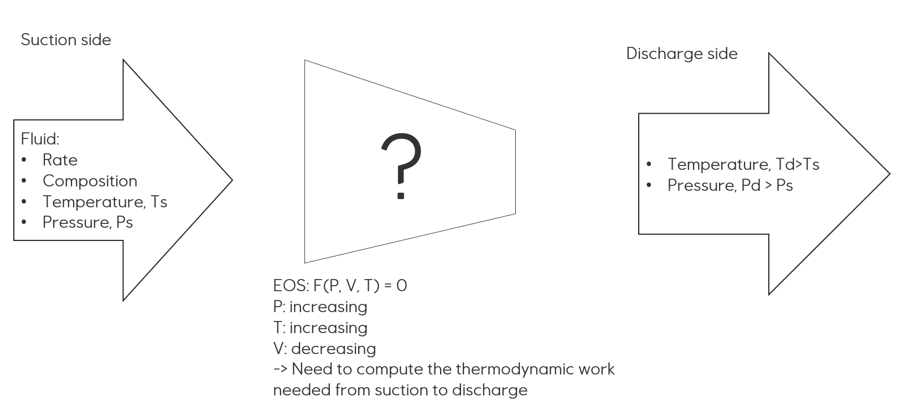
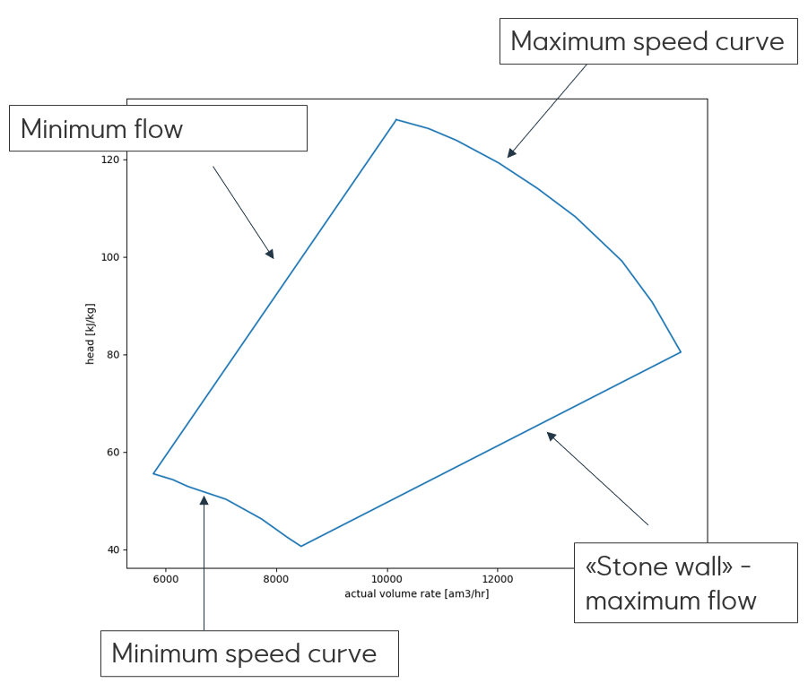
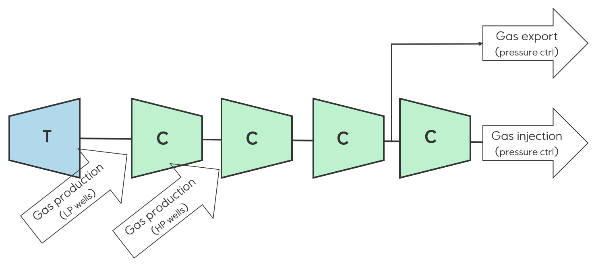

A compressor model describes what happens to a fluid going through a compressor and calculates how much power is
required in the process.

At the suction side, one need information about the fluid (natural gas) which has a (static) specification of the
composition, a specified rate, a temperature and a pressure. As the fluid is going through the compressor in a fluid
dynamic process, the enthalpy changes, resulting in a new state and both the pressure and the
temperature of the fluid is increased, while the volume is decreased. This change is calculated using an
equation-of-state (EOS) model. See [`Fluid model`](../setup/models/fluid_model)

eCalc does not perform fluid dynamic modeling. Instead, the behaviour of the compressor is described by a polytropic
compressor chart which specifies both the operational domain of the compressor, but also relates volume rate, head and
efficiency for the compressor.

An isentropic (adiabatic) compression is the process where no heat is added or removed from a system. In a polytropic
process, changes in the gas characteristics is considered. Dynamic natural gas compressors typically follow a polytropic
process defined by the formula $P_\mathrm{1} V_\mathrm{1}^n = P_\mathrm{2} V_\mathrm{2}^n$, where $n$ is the
polytropic exponent which is experimentally determined for a given compressor.

The power need for compression is given by

$$
power = \frac{polytropic\_head * mass\_rate}{efficiency}
$$

and the relationship between polytropic head and the pressures are

$$
polytropic\_head = \frac{n}{n-1} \frac{Z R T_1}{MW} \left( \left(\frac{P_1}{P_2} \right)^{\frac{n-1}{n}} -1 \right)
$$

where $n$ is the polytropic exponent, $Z$ the compressibility, $R$ is the gas constant, $T_1$ is the inlet temperature and $MW$ the molecular weight.

Further, the polytropic exponent is approximated as

$$
\frac{\kappa * polytropic\_efficiency}{\kappa -1}
$$

where $\kappa$ is the heat capacity ratio of the fluid.

$\kappa$ and $Z$ are not for inlet conditions, but average values for the fluid throughout the process, and
the polytropic process and the calculations are iterated until these converge.

If there is only one compressor, the outlet pressure for each compressor is known, and the polytropic head and
efficiency may be calculated from directly from the above polytropic head and efficiency formulas. 

However, for compressor trains, the intermediate pressures are not known ahead, instead one may use the fact that all
compressors run with the same speed as they are mounted on the same shaft.

To calculate the energy usage for the compressor train using the common speed, eCalc uses a forward model to
calculate the outlet stream given the inlet stream and a given speed. Then, this model is iterated until the discharge pressure is equal to the requested discharge pressure for evaluation. To use this model, see 
`Variable speed compressor train model` An alternative is to neglect the common speed property of the train, an instead assume (incorrectly but maybe good
enough for some purposes) that the pressure fraction is equal for all stages. With this assumption, the intermediate pressures can be calculated and each stage may be calculated independently without the speed iteration. To use this model, see 
`Simplified variable speed compressor train model`.

In some cases, the shaft of the compressor train can only run on a single fixed speed. In these cases eCalc needs
information about how the pressure should be controlled to meet the required discharge pressure. Available pressure
control options are choking and recirculating using anti-surge valves. To use this model, see `Single speed compressor train model`.

In other cases, the compressor trains have more complex setup and process control which needs a more flexible model. The
figure below shows an example where one may have two inlet streams with different pressures and potentially different
gas compositions and one outlet stream for export gas with a pressure control. To use a model suitable for such cases,
see `Variable speed compressor train model with multiple streams and pressures`.

