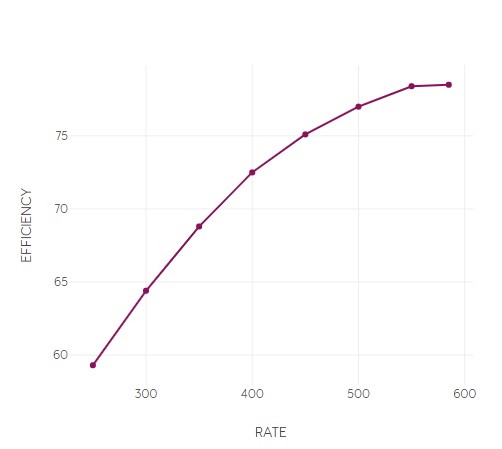
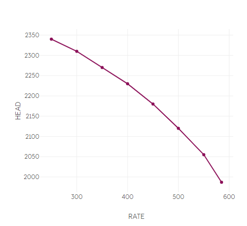

As liquid can be assumed incompressible, pump calculations are simpler compared to compressor calculations. The pumped fluid can be characterized with its density, and no fluid calculations are necessary.

The power demand of a pump is calculated as

$$
power = \frac{head * mass\_rate}{efficiency}.
$$

Here, the relationship between head and pressures is given by

$$
head = \frac{(P_2-P_1)}{liquid\_density * g}
$$

where $P_1$ and $P_2$ are the pump suction and discharge pressures, respectively, and $g$ is the gravitational constant.

eCalc uses the pump chart to relate liquid flow, head and efficiency for the pump, as well as defining the operational envelope for the pump.

For single speed pumps, eCalc does extrapolations corresponding to minflow (liquid recirculation) and choking to keep the pump operation within the operational envelope.

 

