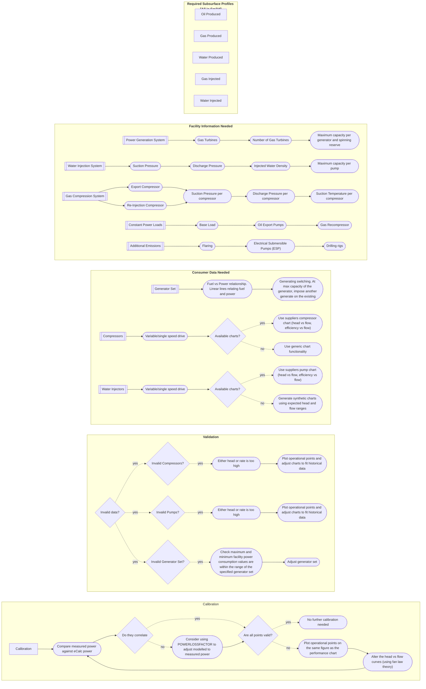

## Simplified Process Flow Diagram
The image below illustrates a simplified process flow diagram for a generic offshore oil and gas facility. Each unit included in this diagram can be modelled with the use of eCalc. 
The [workflow](#workflow) below will outline what is necessary to obtain for each step. In addition, there are some accompanied [explanations](#workflow-explanation) to the workflow.

## Workflow 

## Workflow Explanation

### Required Subsurface Profiles

All subsurface profiles must be in Sm3/day. This data must be inputted as a `TIME-SERIES` and references to how it is used in the facility or by a relevant consumer.

### Facility Information

#### Constant Power Loads

To simplify certain models, there are some common assumptions made. Here are some examples:

- **Base Load**: As eCalc™ is not simulating the whole facility there are often energy consumers that are not modelled. 
Typically these energy consumers relate to things such as the energy consumption of living quarters and are often constant loads.
These smaller constant loads are then grouped into a larger term, called the "baseload". This is assumed to be constant and independent of the production rate of the facility.
- **Recompressor**: The main function of a recompressor is to compressor gas from separator pressures back up to the inlet separator pressure.
These compressors are often smaller and have little fluctuation in their load.
Thus, to simplify modelling, these recompressors are often modelled as constant loads. And at times, are included within the facility's base load
- **Oil Export Pumps**: As eCalc™ does not model oil pumps, these are often modelled as constant loads or modelled with a table (that relates oil rate to power consumption). The method in which they are modelled depends from facility to facility 

#### Additional Information

Any emissions that do not fall within the defined categories can still be considered for a given platform. For example, if there are drilling activities, an additional fuel type can be specified and related to the fuel consumption of a drilling rig. 

### Consumer Information

#### Generator Set

As eCalc™ does not indepthly model gas turbine generators, alternative methods are used. 
Here, fuel consumed and power generated is related in tabular form. These are typically linear relationships, and if more than one generator is used, "generator switching" is modelled by adding another generator curve on top of the existing.

This means that the facility will operate in the most efficient manner, i.e. meaning that if one generator will satisfy the power demand, only one generator will always be used. 

#### Compressor Curves

eCalc™ has generic compressor curve functionality which can be used when compressor curves are not available. 
However, if a manufactor compressor chart is available, it is always recommended to use this over a generic chart. 
The generic compressor curves, use the assumption of constant polytropic efficiency, which is only a good assumption if the compressor is running near the design points. 

### Validation

Checking whether an eCalc™ model is valid or not, is an essential task. If a model is not valid, this means that input requirements set by the user are not being fulfilled, or that some consumers are giving unrealistic solutions.

Validity can be checked by consumer, and there are often specific reasons why certain consumers are invalid. For example:

- **Compressors and Pumps**: It is common that either too high a head or rate value is specified. This means that the invalid point is outside the limits of the performance chart. To determine the issue, it is recommended that the operational points (Head, and actual flowrate) are plotted together with the chart.
- **Generator Set**: The most common issue here is that the amount of power required is higher than the maximum value in the utilised genset. 

### Calibration

The term calibration in eCalc™ often refers to the history matching of the facility. Essentially, real operational data is compared against the eCalc™ model results. If they do not correlate various changes are made to the model.

The main workflow with this would be to match every individual consumer, e.g. each pump and compressor. After that, it is the recommended to compare on the facility level (e.g. total power consumed or total fuel used), then various adjustments can be made.
These adjustments can mean changes to the base load, shifting the compressor curves, or simply by using a [POWERLOSSFACTOR](/about/references/keywords/POWERLOSSFACTOR.md).