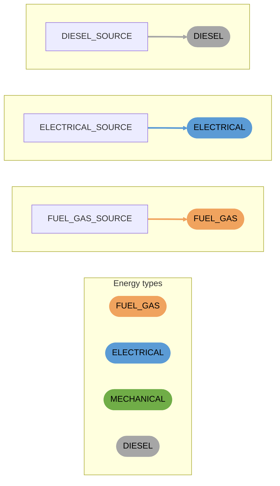

# Sources

External energy entering the network. Sources only have an output. Connections are coloured by the energy type they accept or provide.

```mermaid
graph LR
    subgraph legend ["Energy types"]
        direction LR
        legend_FUEL_GAS(["FUEL_GAS"])
        legend_ELECTRICAL(["ELECTRICAL"])
        legend_MECHANICAL(["MECHANICAL"])
        legend_DIESEL(["DIESEL"])
    end
    subgraph box_FUEL_GAS_SOURCE [" "]
        direction LR
        FUEL_GAS_SOURCE["FUEL_GAS_SOURCE"]
        FUEL_GAS_SOURCE --> FUEL_GAS_SOURCE_out0_FUEL_GAS(["FUEL_GAS"])
    end
    subgraph box_ELECTRICAL_SOURCE [" "]
        direction LR
        ELECTRICAL_SOURCE["ELECTRICAL_SOURCE"]
        ELECTRICAL_SOURCE --> ELECTRICAL_SOURCE_out0_ELECTRICAL(["ELECTRICAL"])
    end
    subgraph box_DIESEL_SOURCE [" "]
        direction LR
        DIESEL_SOURCE["DIESEL_SOURCE"]
        DIESEL_SOURCE --> DIESEL_SOURCE_out0_DIESEL(["DIESEL"])
    end
    classDef FUEL_GAS fill:#f0a35e,stroke:#f0a35e,color:#000
    class legend_FUEL_GAS,FUEL_GAS_SOURCE_out0_FUEL_GAS FUEL_GAS
    linkStyle 0 stroke:#f0a35e,stroke-width:3px
    classDef ELECTRICAL fill:#5b9bd5,stroke:#5b9bd5,color:#000
    class legend_ELECTRICAL,ELECTRICAL_SOURCE_out0_ELECTRICAL ELECTRICAL
    linkStyle 1 stroke:#5b9bd5,stroke-width:3px
    classDef MECHANICAL fill:#70ad47,stroke:#70ad47,color:#000
    class legend_MECHANICAL MECHANICAL
    classDef DIESEL fill:#a6a6a6,stroke:#a6a6a6,color:#000
    class legend_DIESEL,DIESEL_SOURCE_out0_DIESEL DIESEL
    linkStyle 2 stroke:#a6a6a6,stroke-width:3px
```
