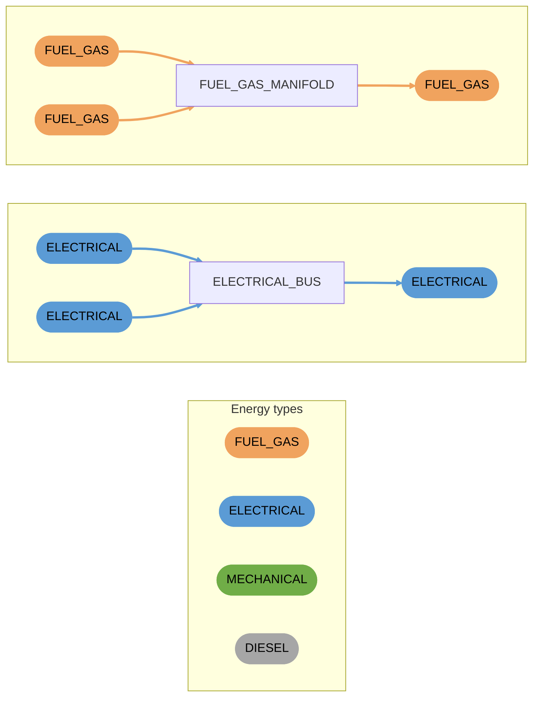

# Junctions

Collect several suppliers of the same energy type and dispatch demand between them. Connections are coloured by the energy type they accept or provide.

```mermaid
graph LR
    subgraph legend ["Energy types"]
        direction LR
        legend_FUEL_GAS(["FUEL_GAS"])
        legend_ELECTRICAL(["ELECTRICAL"])
        legend_MECHANICAL(["MECHANICAL"])
        legend_DIESEL(["DIESEL"])
    end
    subgraph box_ELECTRICAL_BUS [" "]
        direction LR
        ELECTRICAL_BUS["ELECTRICAL_BUS"]
        ELECTRICAL_BUS_in0_ELECTRICAL(["ELECTRICAL"]) --> ELECTRICAL_BUS
        ELECTRICAL_BUS_in1_ELECTRICAL(["ELECTRICAL"]) --> ELECTRICAL_BUS
        ELECTRICAL_BUS --> ELECTRICAL_BUS_out0_ELECTRICAL(["ELECTRICAL"])
    end
    subgraph box_FUEL_GAS_MANIFOLD [" "]
        direction LR
        FUEL_GAS_MANIFOLD["FUEL_GAS_MANIFOLD"]
        FUEL_GAS_MANIFOLD_in0_FUEL_GAS(["FUEL_GAS"]) --> FUEL_GAS_MANIFOLD
        FUEL_GAS_MANIFOLD_in1_FUEL_GAS(["FUEL_GAS"]) --> FUEL_GAS_MANIFOLD
        FUEL_GAS_MANIFOLD --> FUEL_GAS_MANIFOLD_out0_FUEL_GAS(["FUEL_GAS"])
    end
    classDef FUEL_GAS fill:#f0a35e,stroke:#f0a35e,color:#000
    class legend_FUEL_GAS,FUEL_GAS_MANIFOLD_in0_FUEL_GAS,FUEL_GAS_MANIFOLD_in1_FUEL_GAS,FUEL_GAS_MANIFOLD_out0_FUEL_GAS FUEL_GAS
    linkStyle 3,4,5 stroke:#f0a35e,stroke-width:3px
    classDef ELECTRICAL fill:#5b9bd5,stroke:#5b9bd5,color:#000
    class legend_ELECTRICAL,ELECTRICAL_BUS_in0_ELECTRICAL,ELECTRICAL_BUS_in1_ELECTRICAL,ELECTRICAL_BUS_out0_ELECTRICAL ELECTRICAL
    linkStyle 0,1,2 stroke:#5b9bd5,stroke-width:3px
    classDef MECHANICAL fill:#70ad47,stroke:#70ad47,color:#000
    class legend_MECHANICAL MECHANICAL
    classDef DIESEL fill:#a6a6a6,stroke:#a6a6a6,color:#000
    class legend_DIESEL DIESEL
```
