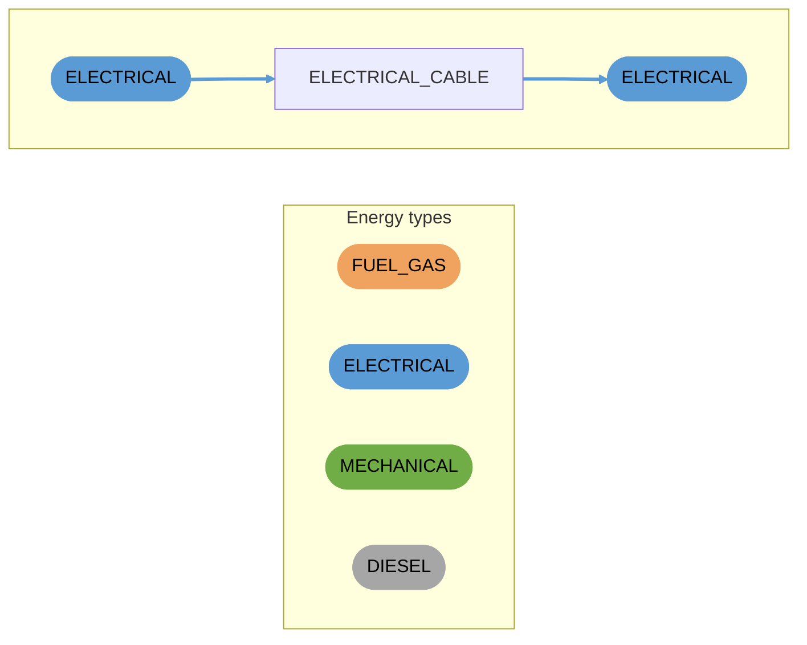

# Transporters

Carry energy from one place to another, with losses. The energy type is the same on both sides. Connections are coloured by the energy type they accept or provide.

```mermaid
graph LR
    subgraph legend ["Energy types"]
        direction LR
        legend_FUEL_GAS(["FUEL_GAS"])
        legend_ELECTRICAL(["ELECTRICAL"])
        legend_MECHANICAL(["MECHANICAL"])
        legend_DIESEL(["DIESEL"])
    end
    subgraph box_ELECTRICAL_CABLE [" "]
        direction LR
        ELECTRICAL_CABLE["ELECTRICAL_CABLE"]
        ELECTRICAL_CABLE_in0_ELECTRICAL(["ELECTRICAL"]) --> ELECTRICAL_CABLE
        ELECTRICAL_CABLE --> ELECTRICAL_CABLE_out0_ELECTRICAL(["ELECTRICAL"])
    end
    classDef FUEL_GAS fill:#f0a35e,stroke:#f0a35e,color:#000
    class legend_FUEL_GAS FUEL_GAS
    classDef ELECTRICAL fill:#5b9bd5,stroke:#5b9bd5,color:#000
    class legend_ELECTRICAL,ELECTRICAL_CABLE_in0_ELECTRICAL,ELECTRICAL_CABLE_out0_ELECTRICAL ELECTRICAL
    linkStyle 0,1 stroke:#5b9bd5,stroke-width:3px
    classDef MECHANICAL fill:#70ad47,stroke:#70ad47,color:#000
    class legend_MECHANICAL MECHANICAL
    classDef DIESEL fill:#a6a6a6,stroke:#a6a6a6,color:#000
    class legend_DIESEL DIESEL
```
