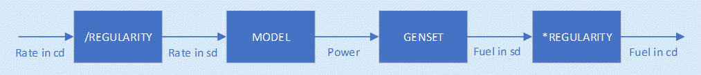

# REGULARITY

[INSTALLATIONS](INSTALLATIONS) /
[REGULARITY](REGULARITY)

## Description

In eCalc™, consumers in an [ENERGY USAGE MODEL](ENERGY_USAGE_MODEL) are evaluated with the actual rate passing through them whilst
they are in operation. This actual rate is referred to as _stream day (sd) rates_.
Despite the consumers being evaluated with stream day rates, input files are often given in _calender day (cd) rates_. As expected from this definition, `REGULARITY` is closely related to the production efficiency (PE) of a facility.

Stream day rates can be expressed as:

$$
stream\ day\ rate = \frac{calendar\ day\ rate}{regularity}
$$

To give an example of this, an input file may have a gas export rate for a whole year. However, this rate will take into account any downtime for the facility. So in reality, this _calender day rate_ is not the rate the compressor will process whilst in operation that year. This will rather be the higher _stream day rate_.

An example of this can be seen in the figure below:

For detailed modeling, it might be a better option to increase the resolution in the [TIME_SERIES](TIME_SERIES.md)
inputs to capture down periods and variations in conditions rather than using regularity.

:::note
- Rates from reservoir simulations may be both stream day and calendar day.
- If eCalc™ is used
without specifying [REGULARITY](REGULARITY), then regularity will default to 1.
- All user defined input rates used in [ENERGY_USAGE_MODEL](ENERGY_USAGE_MODEL) are **assumed to be calendar day rates**.
:::

### Use in a `DIRECT ENERGY USAGE MODEL`

It should be noted that not all [ENERGY USAGE MODELS](ENERGY_USAGE_MODEL) are evaluated with _stream day rates_.
`DIRECT ENERGY USAGE MODELS` can be specified with the keyword [CONSUMPTION_RATE_TYPE](CONSUMPTION_RATE_TYPE) - where either `CALENDAR_DAY` or `STREAM_DAY` can be specified.
Note that the default input rate is `STREAM_DAY` rate - the opposite of the other models.

For further details on stream day rate vs. calendar day rate, see [CONSUMPTION_RATE_TYPE](CONSUMPTION_RATE_TYPE).

|ENERGY_USAGE_MODEL Type|Can use CONSUMPTION_RATE_TYPE?|Evaluated rate type|
|:---:|:---:|:---:|
DIRECT|&#9745; | Stream/calender day|
COMPRESSOR|&#9744;| Stream day|
|PUMP|&#9744;| Stream day|
|COMPRESSOR_SYSTEM|&#9744;| Stream day|
|PUMP_SYSTEM|&#9744;| Stream day|
|TABULATED|&#9744;| Stream day|

### Reporting

- All fuel rates, tax and emission results are reported in calendar days.
- All power and volume rates results are reported in stream day rates. Note that the volume rates are only present in the .json file.

The reason for reporting calendar day rate is due to the economic interpretation, or rather the lack of economic
interpretation when using fuel stream day rates. If we used stream day rates, we would in essence evaluate the process
unit as if it was running all the time. Typically all process units have some down time, and regularity is
on average something closer to 0.99 over a longer period such as a year.

## Format

`REGULARITY` can be specified by a single number or as an expression.

~~~~~~~~yaml
INSTALLATIONS:
  - NAME: <installation name>
    CATEGORY: <installation category>
    REGULARITY: <regularity expression>
~~~~~~~~

## Example

### Constant regularity

~~~~~~~~yaml
REGULARITY: 0.95
~~~~~~~~

### Regularity from time series data

~~~~~~~~yaml
REGULARITY: SIM1;REGULARITY
~~~~~~~~

### Special: Combining calendar and stream day rates

If there is a need to combine stream day and calendar day rates in an expression,
(or to use a stream day rate from a [TIME_SERIES](TIME_SERIES.md) source), one can manually do
what is necessary to obtain calendar day rates by dividing by regularity.

For example, combining a calendar day rate (`SIM2;GAS_PROD_A`) with stream day rate
(`SIM1;GAS_PROD_B`) on an installation with a fixed regularity of 0.95 can be done like:

~~~~~~~~yaml
RATE: SIM2:GAS_PROD_A {+} SIM1;GAS_PROD_B {/} 0.95
~~~~~~~~
