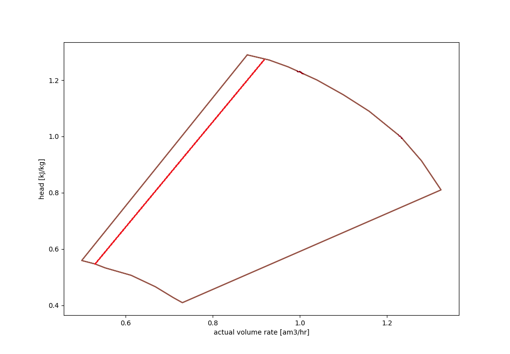

# VARIABLE_SPEED

[MODELS](/about/references/keywords_tree/MODELS/index.md) /
[TYPE](/about/references/keywords_tree/MODELS/TYPE/index.md) :
[COMPRESSOR_CHART](/about/references/keywords_tree/MODELS/TYPE/COMPRESSOR_CHART/index.md) /
[CHART_TYPE](/about/references/keywords_tree/MODELS/TYPE/COMPRESSOR_CHART/CHART_TYPE/index.md) : 
[VARIABLE_SPEED](/about/references/keywords_tree/MODELS/TYPE/COMPRESSOR_CHART/CHART_TYPE/VARIABLE_SPEED/index.md)

## Description 
The variable speed chart type allows a fully defined compressor chart with data for two or more speeds, 
using the keyword [CURVES](/about/references/keywords/CURVES.md). The upper and lower speed curves will be interpreted as the speed 
capacity limits for the chart. Whilst the lowest rate points on each of the upper and lower speed 
curves will define the minimum flow line for the compressor.

Additionally, there is functionality to define a control line which behaves as an alternate to 
the minimum flow line. This means that your input will be 'cropped' to only include points to the 
right of the control line - modelling recirculation (`ASV`) from the correct control line. 
See `Surge control margin for variable speed compressor chart` for more details.

:::note
Using a variable speed compressor chart as input essentially does the same as if a process simulation tool was used to
create an energy function. It has been verified to be close to identical to Unisim within 2% accuracy (smaller
differences in density arise from differences in PVT assumptions and calculations).
:::

### Format
~~~~~~~~yaml
MODELS:
  - NAME: <name of chart, for reference>
    TYPE: COMPRESSOR_CHART
    CHART_TYPE: VARIABLE_SPEED
    UNITS:
      RATE: <rate unit, currently only AM3_PER_HOUR supported>
      HEAD: <polytropic head unit, M, KJ_PER_KG, JOULE_PER_KG supported>
      EFFICIENCY: <polytropic efficiency unit, FRACTION and PERCENTAGE.>
    CURVES:
      - SPEED: <shaft speed for this curve, a number>
        RATE: <list of rate values for this chart curve>
        HEAD: <list of polytropic head values for this chart curve>
        EFFICIENCY: <list of polytropic efficiency values for this chart curve>
      - SPEED: <shaft speed for this curve, a number>
        RATE: <list of rate values for this chart curve>
        HEAD: <list of polytropic head values for this chart curve>
        EFFICIENCY: <list of polytropic efficiency values for this chart curve>
      - ... and so forth for all chart curves. Minimum two curves needed.
~~~~~~~~

### Example
~~~~~~~~yaml
MODELS:
  - NAME: predefined_variable_speed_compressor_chart
    TYPE: COMPRESSOR_CHART
    CHART_TYPE: VARIABLE_SPEED
    UNITS:
      RATE: AM3_PER_HOUR
      HEAD: M
      EFFICIENCY: FRACTION
    CURVES:
      - SPEED: 7500
        RATE: [2900, 3503, 4002, 4595.0]
        HEAD: [8412.9, 7996, 7363, 6127]
        EFFICIENCY: [0.72, 0.75, 0.74, 0.70]
      - SPEED: 9886
        RATE: [3708, 4502, 4993.6, 5507, 5924]
        HEAD: [13845, 13182, 12425, 11276, 10054]
        EFFICIENCY: [ 0.72, 0.75, 0.748, 0.73, 0.70]
      - SPEED: 10767
        RATE: [4052, 4500, 4999, 5492, 6000, 6439,]
        HEAD: [16447, 16081, 15546, 14640, 13454, 11973,]
        EFFICIENCY: [0.72, 0.73, 0.74, 0.74, 0.72, 0.70]
~~~~~~~~

:::tip Tip
It is also possible to input variable speed compressor chart as csv file.

#### Format

~~~~~~~~yaml
CURVES:
  FILE: <csv file with variable speed compressor chart>
~~~~~~~~

#### Example

~~~~~~~~yaml
CURVES:
  FILE: compressor_chart_variable_speed.csv
~~~~~~~~
:::

## Surge control margin for variable speed compressor chart

For a variable speed compressor chart it is possible to add a surge control margin. This is currently done by giving a
fraction or percentage as input. The control margin is used to calculate the increase in minimum flow, i.e. as a percentage 
or fraction of the rate difference between minimum- and maximum flow, for the given speed. The increase in minimum
flow is calculated individually for each speed curve. The corresponding head and efficiency values for the new minimum flow rate
is found by interpolation along the speed curves. The same compressor chart can be used for multiple compressor stages,
but with different surge control margins. Hence, the surge control margin is defined when setting up the stages in a
[`Variable speed compressor train model`](/about/modelling/setup/models/compressor_modelling/compressor_models_types/variable_speed_compressor_train_model.md) or [`Variable speed compressor train model with multiple streams and pressures`](/about/modelling/setup/models/compressor_modelling/compressor_models_types/variable_speed_compressor_train_model_with_multiple_streams_and_pressures.md).

### Format
~~~~~~~~yaml
MODELS:
  - NAME: <model name>
    TYPE: VARIABLE_SPEED_COMPRESSOR_TRAIN
    FLUID_MODEL: <reference to fluid model, must be defined in [MODELS]
    COMPRESSOR_TRAIN:
      STAGES:
        - INLET_TEMPERATURE: <inlet temperature in Celsius for stage>
          COMPRESSOR_CHART: <reference to compressor chart model for first stage, must be defined in MODELS or FACILITY_INPUTS>
          CONTROL_MARGIN: <Default value is zero>
          CONTROL_MARGIN_UNIT: <FRACTION or PERCENTAGE, default is PERCENTAGE>
~~~~~~~~