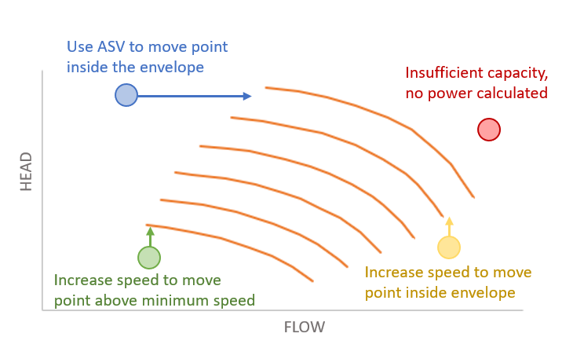

# VARIABLE_SPEED_COMPRESSOR_TRAIN

[MODELS](/about/references/keywords_tree/MODELS/index.md) /
[TYPE](/about/references/keywords_tree/MODELS/TYPE/index.md) :
[VARIABLE_SPEED_COMPRESSOR_TRAIN](/about/references/keywords_tree/MODELS/TYPE/VARIABLE_SPEED_COMPRESSOR_TRAIN/index.md) 

## Description
In this model all compressors in the train have the same speed, and the model is build on a forward model of
the fluid properties/state where speed is a parameter. Then the speed is iterated until the discharge pressure of the
outlet is equal to the requested discharge pressure.

This model only supports `User defined variable speed compressor chart`.

In addition, a [FLUID MODEL](/about/modelling/setup/models/fluid_model.md) must be specified.

**Control mechanisms**

The variable speed comporessor train model has the following automatic control mechanisms:

- **Antisurge control:** When the flowrate is too low, given the suction and discharge pressures, eCalc will use automatic anti-surge control. The use of the anti-surge valve (ASV) is mimicked by increasing the total flow through the compressor, until the head is at the surge line (minimum flow curve) of the compressor chart.
- **Speed increase below minimum speed:** If a rate/head point is below the compressor chart (below minimum speed), the speed is automatically increased to the minimum speed curve.
- **Stonewall speed increase:** When the flowrate is too high, given the suction and discharge pressures, eCalc will automatically increase the speed to meet the stonewall (maximum flow line) of the compressor chart. To achieve the requested discharge pressure, the outlet stream is choked. This control mechanism can be turned off, for cases where a downstream choke valve does not exist.

**Format**

The model is defined under the main keyword [MODELS](/about/references/keywords/MODELS.md) in the format

~~~~~~~~yaml
MODELS:
  - NAME: <model name>
    TYPE: VARIABLE_SPEED_COMPRESSOR_TRAIN
    FLUID_MODEL: <reference to fluid model>
    COMPRESSOR_TRAIN:
      STAGES:
        - INLET_TEMPERATURE: <inlet temperature in Celsius for stage>
          COMPRESSOR_CHART: <reference to compressor chart model for first stage, must be defined in MODELS or FACILITY_INPUTS>
          CONTROL_MARGIN: <Surge control margin for the compressor stage. Default value 0.0>
          PRESSURE_DROP_AHEAD_OF_STAGE: <Pressure drop before compression stage [in bar]>
          CONTROL_MARGIN_UNIT: <FRACTION or PERCENTAGE, default is PERCENTAGE>
        - INLET_TEMPERATURE: <inlet temperature in Celsius for stage>
          COMPRESSOR_CHART: <reference to compressor chart model for second stage, must be defined in MODELS or FACILITY_INPUTS>
          CONTROL_MARGIN: <Surge control margin for the compressor stage. Default value 0.0>
          PRESSURE_DROP_AHEAD_OF_STAGE: <Pressure drop before compression stage [in bar]>
          CONTROL_MARGIN_UNIT: <FRACTION or PERCENTAGE, default is PERCENTAGE>
        - ... and so forth for each stage in the train
    POWER_ADJUSTMENT_CONSTANT: <Optional constant MW adjustment added to the model>
    MAXIMUM_POWER: <Optional constant MW maximum power the compressor train can require>
    CALCULATE_MAX_RATE: <Optional compressor train max standard rate [Sm3/day] in result if set to true. Default false. Use with caution. This will increase runtime significantly. >
    PRESSURE_CONTROL: <method for pressure control, DOWNSTREAM_CHOKE (default), UPSTREAM_CHOKE, , INDIVIDUAL_ASV_PRESSURE, INDIVIDUAL_ASV_RATE, COMMON_ASV or NONE>
~~~~~~~~